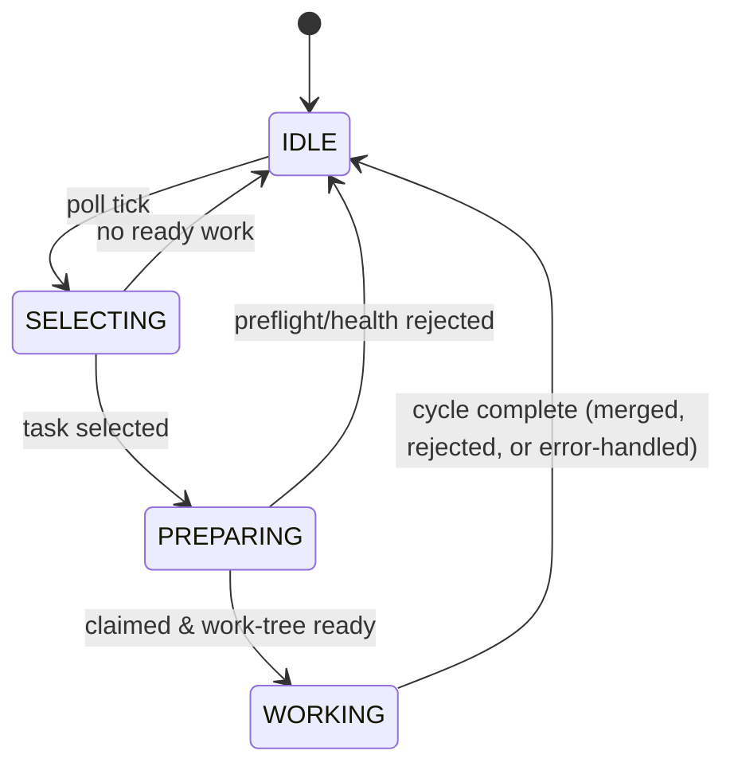

# Architecture

This document describes how Shreni works internally — the components, the worker
lifecycle, the git workflow, and the resilience machinery that lets it run
unattended. For a quick orientation and setup, see the [README](README.md).

Shreni is an **autonomous coding-agent harness**: it picks up structured tasks,
writes and reviews code, runs tests, and merges approved changes to `main`
without a human in the inner loop. The design goal throughout is *unattended
correctness* — the system must make progress on its own and, when it can't, fail
loudly and recover cleanly rather than wedge silently.

## Components

Shreni names its parts in Sanskrit; each maps to a directory under `src/`.

| Component | Code | Role |
|---|---|---|
| **Sthapathi** (architect) | [`src/sthapathi/`](src/sthapathi/) | Orchestrator. Owns the task lifecycle, the git workflow, and the poll loop. The only caller of `bd --claim` / `bd close`. |
| **Silpi** (craftsman) | [`src/agents/silpi.ts`](src/agents/silpi.ts) | Coding agent. Given a task with injected context, writes implementation + unit tests, runs lint/tests, submits for review. |
| **Viharapala** (guardian) | [`src/agents/viharapala.ts`](src/agents/viharapala.ts) | Review agent. Judges Silpi's output against acceptance criteria, quality, and coverage; returns `APPROVE` / `REJECT` with structured feedback. |
| **Parikshaka** (examiner) | [`src/agents/parikshaka.ts`](src/agents/parikshaka.ts) | Test agent. Runs asynchronously after merge; backfills tests for shipped work and files coverage-gap beads. Read-only w.r.t. source. |
| **Phalaka** (panel) | [`src/phalaka/`](src/phalaka/) | Loopback dashboard. Serves worker status, task progress, and stuck-state alerts across all Kshetras. |

The three worker agents (Silpi, Viharapala, Parikshaka) are **never allowed to
touch the task tracker** — Sthapathi is the sole authority over bead state. Agents
receive everything they need as injected prompt context and return structured
output.

## The Kshetra: the unit of isolation

Every project Shreni manages is a **Kshetra** (Sanskrit: *field*). A Kshetra owns:

- its own git repository,
- its own `bd` (Beads) task database,
- its own configuration, and
- its own worker process and phase state.

Kshetras are fully isolated — no shared context, tasks, or git state. A crash in
one never affects another.

**Configuration has exactly one source of truth per Kshetra:**
`<repo>/.shreni/kshetra.yaml`, validated by a Zod schema
([`src/kshetra/config.ts`](src/kshetra/config.ts)). A single global registry,
`~/.shreni/registry.json`, is the only thing that resolves `id → configPath`
([`src/kshetra/registry.ts`](src/kshetra/registry.ts)). Paths in the config are
absolute and used verbatim as the cwd for git/exec.

Runtime state (worker phase, pause/stuck flags, stall counters) lives under
`~/.shreni/` — nothing is emitted off-box.

## Process model

`shreni start` launches **one worker process per Kshetra**
([`src/cli/worker.ts`](src/cli/worker.ts)). Each worker has its own PID and logs
under `~/.shreni/`, so one Kshetra hanging or crashing never takes the others
down. The CLI ([`src/cli/index.ts`](src/cli/index.ts)) is the entry point for all
commands (`start`, `stop`, `status`, `pause`, `resume`, `run`, `sync`,
`init-kshetra`, `register`, `phalaka`, …).

## The worker lifecycle

The heart of the system is a small phase machine
([`src/sthapathi/index.ts`](src/sthapathi/index.ts)). A worker polls every 30s
(`DEFAULT_INTERVAL_MS`) and runs one cycle at a time:



This diagram is not just documentation: the same edges are the typed transition
table in [`src/sthapathi/lifecycle.ts`](src/sthapathi/lifecycle.ts), and
`setPhase` consults its `canTransition` guard on every phase change. An illegal
jump — most importantly a *write-only latch* (a phase with no edge back to
`IDLE`, the Watchdog-ARD bug class) — is a unit-test failure and a runtime
warning. It is deliberately a lightweight table, not a state-machine library: bd,
git, and `state.json` stay the durable sources of truth; a heavier engine is
deferred to post-launch.

Two invariants make this safe under a repeating timer:

1. **One task at a time is structural, not emergent.** A cycle runs *only* from
   `IDLE`, and the phase is advanced synchronously before the first `await`, so an
   overlapping tick for the same Kshetra is an immediate no-op. A single-flight
   latch in `scheduleLoop` additionally skips ticks while a cycle is running.
2. **SELECT is read-only; PREPARE is the only mutator.** Choosing the next task
   performs no git operations and no claim, so polling for work can never check
   out `main` underneath an in-flight agent. Only once a task advances to PREPARE
   does the worker touch the work tree. This separation is what eliminates the
   class of "agent knocked off its branch" failures.

### SELECT — pick the next task

[`selectNext`](src/sthapathi/pickup.ts) reads `bd ready` and picks the
highest-priority bead (P0 first, then FIFO within a priority). No side effects.

### PREPARE — claim and set up the work tree

[`prepareTask`](src/sthapathi/pickup.ts) is the only mutator in the pickup path.
In order, it:

1. syncs the beads DB (commit local → pull --rebase → push),
2. runs **preflight**: `checkout main`, guard against a dirty tree, `pull --rebase`,
   and guard against a leftover `bead-{id}/{slug}` branch,
3. runs the **health gate**: a feature task only starts when the base test suite
   is green (modulo an accepted baseline). A red base does **not** start the task —
   it queues a P0 `[shreni-health]` repair bead (which is exempt from the gate),
4. claims the bead (`bd update --claim`).

Every rejection is logged and recorded as a *stall* so the watchdog can trip if
the same rejection repeats — a wedge is never silent.

### WORK — the Silpi ↔ Viharapala loop

[`runSilpiViharapalaLoop`](src/sthapathi/dispatch.ts) runs the review loop for the
prepared task on its own `bead-{id}/{slug}` branch:

1. **Silpi** implements the task (code + unit tests) and runs the configured lint
   and test gates.
2. **Viharapala** reviews the branch and returns `APPROVE` or `REJECT` with
   structured feedback.
3. On `REJECT`, Silpi is re-dispatched with the feedback, up to
   `agents.maxRoundsPerBead` rounds (default 3).
4. On `APPROVE`, the outcome depends on `repo.mergePolicy`
   ([`src/sthapathi/merge.ts`](src/sthapathi/merge.ts)):
   - `push` (default): the branch is squash-merged to `main` and the bead is closed.
   - `pr`: the branch is pushed and a pull request is opened; the bead is kept open
     (labelled `awaiting-merge`) so dependents stay blocked, and is closed later by
     the reconcile pass only when its PR actually merges. `resolveMergePolicy` lets
     `SHRENI_MERGE_POLICY` override the config at runtime.

After a successful merge, **Parikshaka** is dispatched asynchronously
([`src/sthapathi/parikshaka-dispatch.ts`](src/sthapathi/parikshaka-dispatch.ts)) —
it backfills tests and files coverage-gap beads without blocking the loop.

## The git workflow

Sthapathi owns all git operations ([`src/sthapathi/git.ts`](src/sthapathi/git.ts))
so agents never manipulate history directly:

- Each task gets an isolated branch `bead-{id}/{slug}`.
- Approved work is **squash-merged** to `main` — one clean commit per bead — or,
  under `mergePolicy: pr`, opened as a pull request and reconciled on merge.
- `safePush` handles a non-fast-forward push by `pull --rebase`-ing and retrying.
- Merge conflicts are triaged
  ([`handleMergeConflict`](src/sthapathi/merge.ts)): conflicts confined to the
  task's own files re-dispatch Silpi with conflict context; conflicts in
  out-of-scope files flag the bead and pause for a human, because that signals the
  agent drifted.
- A [branch-isolation guard](src/sthapathi/guard.ts) enforces that agents cannot
  land commits directly on `main`.

## Task tracking (Beads)

Tasks are **beads**, tracked by the `bd` CLI in an embedded, git-synced database
([`src/sthapathi/beads.ts`](src/sthapathi/beads.ts)). The wrapper is internal-only
— agents never call `bd`. Sthapathi is the sole caller of `--claim` and `close`,
which keeps task-state transitions single-writer and auditable. Interactive
sessions (e.g. Claude Code) may *file* tasks but cannot claim or close them.

## Provider abstraction

Shreni is model-agnostic behind a small adapter seam
([`src/agents/providers/types.ts`](src/agents/providers/types.ts)):

```ts
interface ProviderAdapter {
  readonly name: Provider;                                  // 'anthropic' | 'gemini' | 'openai'
  buildSpawn(opts: AgentRunnerOpts): SpawnSpec;             // how to launch the CLI
  createParser(opts, emit): StreamParser;                   // how to parse its stream
}
```

Adapters (`claude` / `codex` / `gemini`) live behind a registry
([`src/agents/providers/registry.ts`](src/agents/providers/registry.ts)) and are
selected per Kshetra via `agents.provider` / `agents.model`. Execution is
**native**: the provider's own CLI loads the repo's instruction files (skills,
rules, conventions), and Shreni injects only what the provider can't load itself
(e.g. a reviewer-only review guide). A `StreamParser` turns the CLI's streamed
output into a structured result and counts tool calls; `finalize` throws on
transport/agent error so the dispatcher's retry logic can react.

## Resilience: staying unattended

Running without a human in the loop means the system must detect and recover from
its own failures.

### Liveness and the watchdog

Each worker stamps a **heartbeat file** on a fixed cadence while a phase is active
([`src/sthapathi/activity-log.ts`](src/sthapathi/activity-log.ts)). Liveness is the
age of that file's mtime — deliberately decoupled from agent output, so a long
silent tool call doesn't read as a hang.

The **watchdog** ([`src/sthapathi/watchdog.ts`](src/sthapathi/watchdog.ts)) runs
every 60s and trips on either of two independent conditions:

- **Liveness timeout** — no heartbeat for `stuckThresholdMs` (default 20m) *while a
  phase is active*.
- **Stall loop** — the same non-advancing outcome repeated `maxOutcomeRepeat`
  times (default 5), e.g. the same preflight rejection every poll.

A Kshetra that is simply **idle with an empty queue never trips** — "nothing to
do" is distinguished from "hung" by probing the raw ready queue. On a genuine
trip, the watchdog sets a stuck banner, pauses for manual resume, and emits an
operator notification with concrete remediation steps.

### Errors

Cycle errors are classified and handled
([`src/sthapathi/errors.ts`](src/sthapathi/errors.ts)): `API_DOWN` pauses with a
cooldown and retries; `AGENT_FAILED` / `MALFORMED_OUTPUT` flag the bead and clean
the branch; `GIT_FAILED` keeps the branch for inspection and pauses for a human;
`BD_FAILED` pauses. Every terminal state also emits an operator notification. The
notification feed is durable and per-Kshetra — Phalaka polls it.

### Recovery and self-heal

State can drift across a crash/restart along four axes: the working tree, stale
`bead-*` branches, orphaned `in_progress` beads, and the persisted phase.
**RECOVER** ([`src/sthapathi/recover.ts`](src/sthapathi/recover.ts)) reconciles all
four back to a clean `IDLE` and reopens stranded WIP for a fresh, gated pickup. It
runs at startup *before the poll loop is armed*, so recovery never races a poll
tick.

The same machinery powers **in-process self-heal**
([`src/sthapathi/self-heal.ts`](src/sthapathi/self-heal.ts)): when `shreni resume`
clears a stuck worker's pause, an ordered sequence — refresh liveness → abort the
hung provider subprocess → await the run fully unwinding → RECOVER → refresh
liveness — heals a wedged worker without a restart. The ordering is load-bearing:
liveness is refreshed first so the watchdog can't re-trip mid-heal, and a `healing`
gate makes SELECT return `null` so no poll cycle mutates the tree during recovery.

## Local observability: Phalaka

[`Phalaka`](src/phalaka/) is a single-file dashboard served on loopback
(`127.0.0.1`) by Fastify. It reads worker state, bead data, and the notification
feed, and renders status/progress/stuck alerts across all Kshetras. It is
token-authenticated (`~/.shreni/shreni.token`) and serves no data off-box. The CLI
also exposes the same information textually (`shreni status`, `shreni agents`,
`shreni logs`).

## Directory map

```
src/
├── cli/         # command entry points; worker.ts drives one Kshetra
├── sthapathi/   # orchestrator: scheduler, pickup, dispatch, git, merge,
│                #   watchdog, recover, self-heal, errors, beads wrapper
├── agents/      # silpi, viharapala, parikshaka + provider adapters
├── kshetra/     # config schema, registry, runtime state, toolchain defaults
└── phalaka/     # loopback dashboard (server, api, ui)
```
