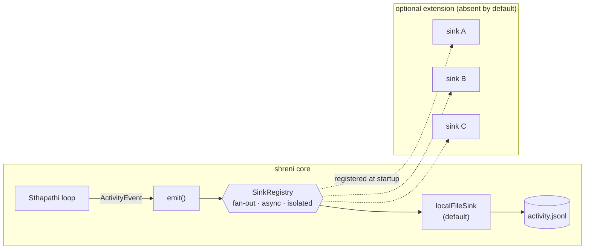
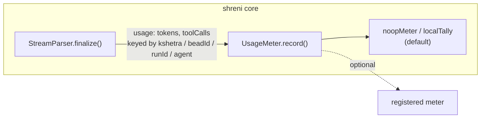
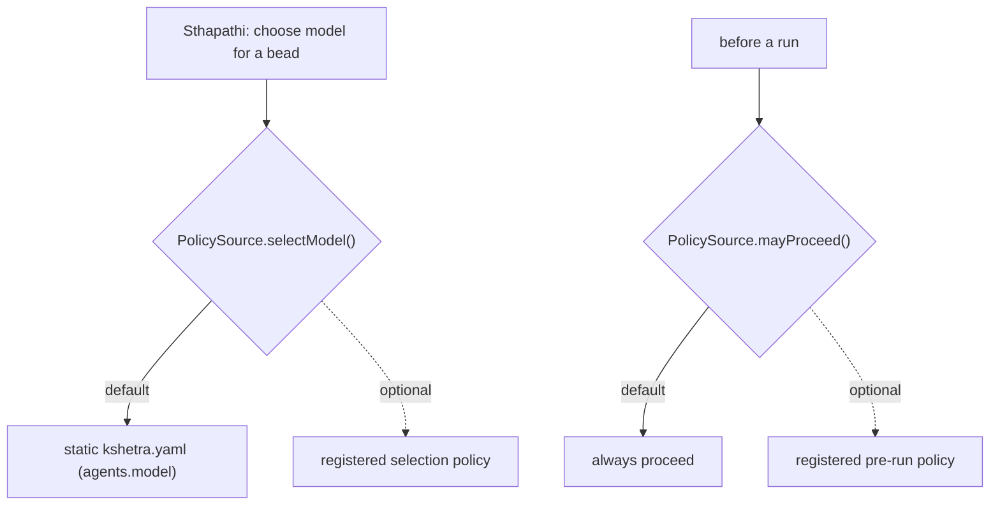
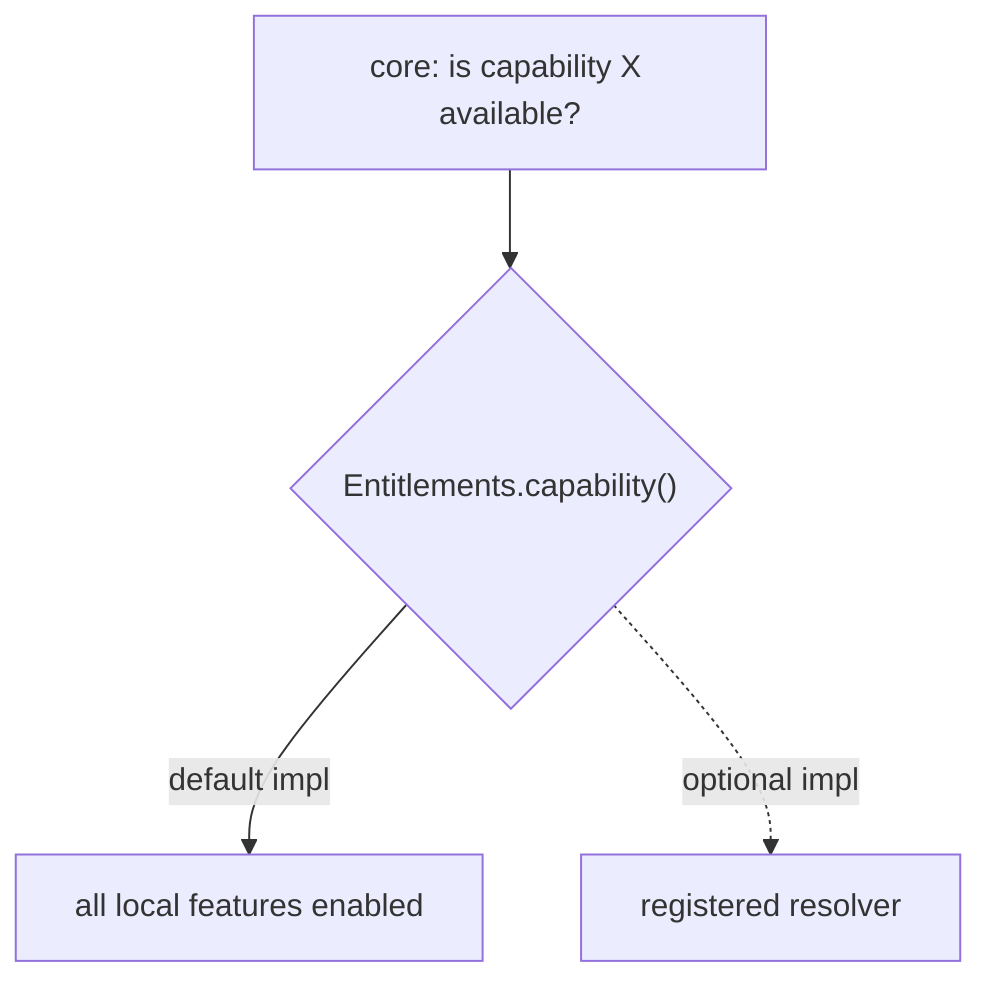
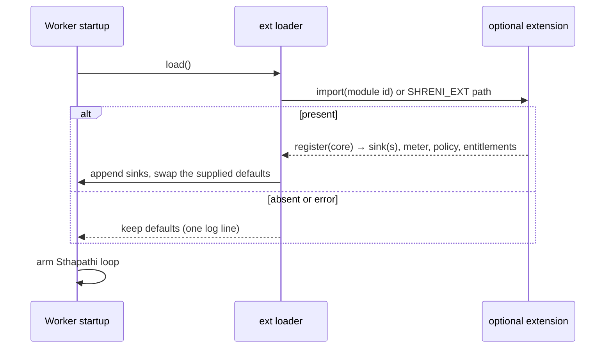

# Extension Points

Shreni runs as a complete, self-contained tool on a single developer's machine —
no account, no server, no network dependency. To let **optional packages add
capability without forking the core**, the core exposes a small set of extension
interfaces with built-in default implementations. With no extension present the
defaults provide today's full behavior; an optional package may register its own
implementations to observe, meter, or influence the run.

This mirrors the existing `ProviderAdapter` seam
([src/agents/providers/types.ts](../../src/agents/providers/types.ts)): a small
interface in the core, a registry, and implementations supplied behind it.

Design rule: **the interfaces and their default implementations live in the core;
implementations that need external services live in a separate package.** No
capability is removed from the standalone tool — an extension only *adds* to it,
and any extension is entirely optional.

## The four seams

All four live in `src/ext/` and ship with free, local default implementations.

| Seam | Purpose | Default implementation |
|------|---------|------------------------|
| **`EventSink` (fan-out registry)** | Observe lifecycle / activity events (task claimed, round start, agent output, review verdict, task done). | Local writer → `~/.shreni/kshetra/<id>/activity.jsonl` |
| **`UsageMeter`** | Receive per-run records (token usage, tool-call counts) as each agent run finalizes. | No-op (or local tally) |
| **`PolicySource`** | Decide which model/provider handles a task and whether a run may proceed. | Static, from `kshetra.yaml` (`agents.model`) |
| **`Entitlements`** | Resolve capability flags and limits for optional features. | All locally-available features enabled |

Nothing is emitted off the machine by any default implementation. Sending data
anywhere is exclusively the behavior of an optional registered implementation.

## The `EventSink` fan-out registry

Rather than a single replaceable event handler, the core keeps an **ordered list
of sinks** and fans every event out to all of them. This lets independent
observers attach side-by-side — the local file writer is simply the first sink in
the default list, and additional sinks (if an extension registers any) receive the
same stream.

Fan-out is **asynchronous and failure-isolated**: each sink is invoked inside its
own guard, so a slow or throwing sink can never stall the orchestrator loop or
prevent the other sinks from receiving the event.

### Event correlation

Every event carries a `schemaVersion` and a `runId` — a correlation id stamped
when a task is claimed and propagated through every downstream event for that
attempt. This makes the event stream a stable, correlatable record that a
consumer can group by task attempt without reconstructing causality.

## `UsageMeter`

Provider stream parsers already parse the agent's output stream and count tool
calls. The parser also surfaces per-run **token usage** (the stream JSON from the
underlying CLIs carries it) and hands a record to the `UsageMeter` when the run
finalizes. The default meter is a no-op, so the standalone tool is unchanged; an
extension may record or aggregate these numbers.

## `PolicySource`

Model/provider selection — today read statically from `kshetra.yaml` — is routed
through `PolicySource`, and a pre-run check asks whether the run may proceed. The
default returns exactly today's static answer (selected model, always allowed).
Retry, backoff, and provider failover remain in the run dispatcher
([src/agents/runner.ts](../../src/agents/runner.ts)); `PolicySource` owns only
selection and the go/no-go check.

## `Entitlements`

The core never assumes a feature is on or off — it **asks**. `Entitlements`
resolves capability flags and limits; the default implementation answers with all
locally-available features enabled. An optional extension may supply a different
implementation.

## Loading an extension (fail-open)

At worker startup the core attempts to load a single optional extension by a
well-known module id or a path from the `SHRENI_EXT` environment variable. If
present, the extension's `register(core)` entry contributes its `EventSink`(s) and
may supply `UsageMeter` / `PolicySource` / `Entitlements` implementations, which
the core swaps in before the Sthapathi loop arms. If the extension is **absent or
errors**, the core degrades to the defaults with a single log line — it never
crashes and never blocks local use.

Local autonomous coding is the baseline promise of the tool and does not depend on
any extension being installed or reachable.