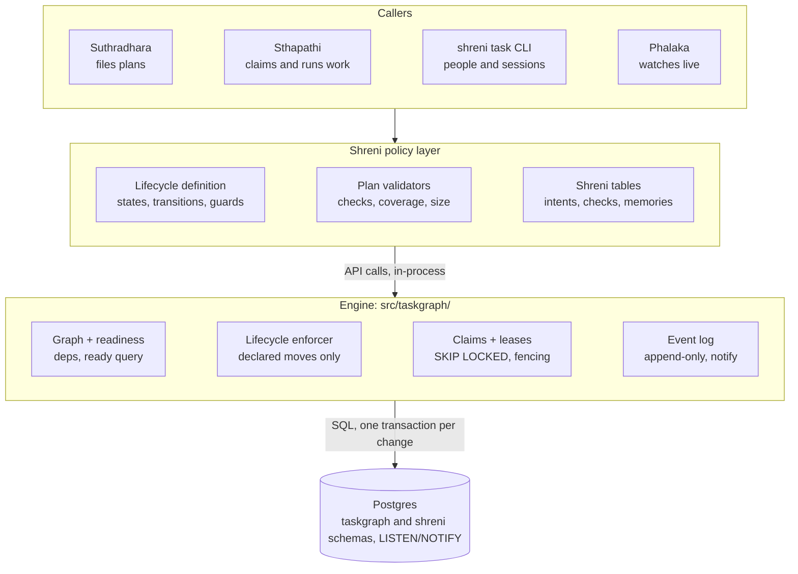

# Task Graph Engine

> **Status:** design, October 2026. The engine is being built under `src/taskgraph/`; none of it has shipped, and Shreni still runs on beads today.

## Overview

`src/taskgraph/` is a TypeScript library that stores a project's task graph in Postgres and guarantees its rules: no cycles, only approved work is pickable, each task is held by at most one worker, and every change is recorded. It replaces `bd` (beads) as Shreni's store of record: several workers, possibly on different machines, need to claim from one live queue, and beads' git-synced history suits occasional merges, not that. This spec covers the engine only. Shreni's lifecycle, roles, approval and validators are in [Task Lifecycle and Policy](task-lifecycle.md).

**Goals**

- Many workers, possibly on different machines, claim work concurrently and safely.
- A call takes milliseconds, in-process, with no subprocess per call.
- Approval, origin and task state are first-class, not labels.
- Every state change is an append-only event that the dashboard can follow live.
- Shreni controls every policy and state transition. The engine is mechanism only: it stores the graph, enforces the lifecycle Shreni declares, and knows nothing about building software.

**Non-goals for v1**

- Shreni's run telemetry (`activity.jsonl`, `usage.jsonl`) and the decision ledger (`ledger.jsonl`) stay files, outside the engine. The migration off beads moves the ledger out of the beads directory.
- No UI; Phalaka and a `shreni task` CLI are the clients.
- No user accounts inside the engine; callers are trusted processes that declare their role.

## Boundary



Every caller goes through Shreni's policy layer, which owns the lifecycle definition, the plan validators and Shreni's own tables. The engine enforces what the policy layer declares and writes each change, with its event, in one transaction. Postgres notifies listeners on commit, so Phalaka and Sthapathi react to changes instead of polling.

| Owned by the engine | Owned by Shreni |
| --- | --- |
| Tables: projects, plans, tasks, dependencies, links, attempts, events | Tables: project details, intents, acceptance checks, memories, attempt evidence |
| Readiness: dependencies satisfied, approved, not held, every container above it claimable; claim order: boosted first, then priority, then age | What "ready" means beyond that: which moves boost, scope filters |
| Enforcing declared transitions atomically | Declaring the states and transitions, and their guards |
| Leases, fencing tokens, expiry | Lease duration, heartbeat cadence, what happens on expiry |
| Running validators inside approval | Writing the validators and their config |

Shreni's side of each row is in the policy spec: its [lifecycle](task-lifecycle.md#the-lifecycle), [boost and expiry settings](task-lifecycle.md#boost-and-repeated-expiry), [validators](task-lifecycle.md#validators), [tables](task-lifecycle.md#shrenis-tables) and [lease use](task-lifecycle.md#running-work).

## Build vs. reuse

Build the core and reuse everything around it. The core (tables, the ready query, the claim, transition enforcement, event writes) is small, an estimated few hundred lines of SQL and TypeScript, and it is exactly the part Shreni must control.

**Where the rules live (2026-10-03): in TypeScript, with backstops in the database.** The rules are already SQL statements: the claim query, the guarded `UPDATE`, the cycle walk and the fencing `WHERE`. The TypeScript library runs them in order, with Shreni's guards and validators between them.

- **Why not PL/pgSQL now.** A database function can't call Shreni's TypeScript guards, which run inside the engine's transaction. Every rule change would also be a migration, and harder to debug.
- **Backstops from the start.** Constraints, the append-only trigger on events, and a trigger on the engine's tables. It refuses a state change the active lifecycle doesn't declare, and any write from a process on another version (see Versions and upgrades).
- **Written to port.** Each operation is one transaction with no network or file calls inside. Each rule is a SQL statement; TypeScript never reads a row, decides, and writes it back. Guards read only the database, permissions are data in the lifecycle, and errors carry stable codes.
- **The tests check the port.** The property tests use only the public API, so they can run unchanged against a PL/pgSQL version.
- **When to port** claim, move, heartbeat and deps.add: when a process that isn't Shreni's own code needs database credentials, or a client that isn't Node needs to write. Validators stay in TypeScript; under database roles, approval would require a passing validation recorded for the plan's current contents.

**Where the code lives (2026-10-06): `src/taskgraph/`, a directory inside Shreni's package, not a workspace package.** `tsconfig.json` compiles only `src/` into `dist/` (`rootDir: src`), the repo has no pnpm workspace, and npm ships `dist/`. A separate package would have to be published to npm on its own, which waits for a second consumer.

- **The boundary is a test.** A vitest test reads every import under `src/taskgraph/` and fails on one that leaves the directory, other than Node built-ins and the libraries adopted below. Shreni has no linter, so the test is the rule.
- **Migrations are modules.** Each migration is a TypeScript module listed in `src/taskgraph/migrations/index.ts`, and the migrator is given that list, not a folder. The single-file binary (`scripts/build-binary.mjs`) bundles everything into one file, so Kysely's file-based provider would find no folder to read.
- **Moving it out later** is the directory, its tests and a new `package.json`.

**Adopt**

| Library | Use for |
| --- | --- |
| [postgres](https://www.npmjs.com/package/postgres) (3.4) | Driver: transactions, `LISTEN`/`NOTIFY`, connection pooling. Kysely has no postgres.js dialect, so the engine carries a small one: a reserved connection per transaction |
| [Kysely](https://www.npmjs.com/package/kysely) (0.29) | Type-safe queries and migrations; the claim query stays hand-written SQL |
| [graphology](https://www.npmjs.com/package/graphology) + [graphology-dag](https://www.npmjs.com/package/graphology-dag) (0.4) | In-memory plan checks before writing: `hasCycle`, `willCreateCycle`, `topologicalGenerations` (which also gives the graph's depth and width for the sizing reviewer) |
| [zod](https://www.npmjs.com/package/zod) (already a Shreni dependency) | Validating the lifecycle definition and task specs |
| [PGlite](https://www.npmjs.com/package/@electric-sql/pglite) (0.5) | Postgres in-process for fast unit tests |
| [pglite-socket](https://www.npmjs.com/package/@electric-sql/pglite-socket) (0.2) | PGlite behind the Postgres wire protocol, so unit tests drive the engine through postgres.js without Docker |
| [@testcontainers/postgresql](https://www.npmjs.com/package/@testcontainers/postgresql) (12.2) | Real Postgres for concurrency tests |
| [fast-check](https://www.npmjs.com/package/fast-check) (4.10) | Property tests for the invariants |

**Considered, not adopted for the core**

| Library | What it offers | Why not |
| --- | --- | --- |
| [pg-boss](https://www.npmjs.com/package/pg-boss) (12.36) | A Postgres job queue on `SKIP LOCKED`, with job dependencies, enqueue inside an existing transaction, `LISTEN`/`NOTIFY` and PGlite support | Jobs have pg-boss's own lifecycle; Shreni's tasks are long-lived records with human states (proposed, waiting, blocked, parked) and Shreni-defined moves. Adopting it means two state models kept in sync. It is the fallback if hand-written leasing proves troublesome: enqueue a job in the same transaction that makes a task ready |
| [graphile-worker](https://www.npmjs.com/package/graphile-worker) (0.18) | A Postgres job queue with `LISTEN`/`NOTIFY` | The same lifecycle mismatch, and no dependency graph |
| [XState](https://www.npmjs.com/package/xstate) (5.33) | Statecharts with an actor runtime | Shreni's lifecycle is a flat, storable table of states and moves; the runtime adds nothing. Revisit if the lifecycle needs nested states |
| [DBOS](https://www.npmjs.com/package/@dbos-inc/dbos-sdk) (5.2), [Hatchet](https://www.npmjs.com/package/@hatchet-dev/typescript-sdk) (1.34), Temporal | Durable workflow execution | They solve a different problem: resuming a long multi-step run after a crash. DBOS, an in-process library on Postgres, is worth evaluating separately for Sthapathi's attempt phases |

Versions are the latest on npm as of this spec.

## Data model

One Postgres database holds every project. Every row carries `project_id`, and every call goes through a handle for one project. The engine's tables live in a `taskgraph` schema; a caller keeps its own tables in another schema, so its writes can join the engine's transactions. Shreni's are listed in the policy spec's [Shreni's tables](task-lifecycle.md#shrenis-tables).

**Hosting (2026-10-05): self-run Postgres, with one database holding many projects, never one per project.** A move to Supabase or Neon comes later, as a dump and restore plus a new connection string; the engine needs nothing from a host beyond plain Postgres 15 or newer and one direct connection for its listener and session locks (see Connections under [Events and history](#events-and-history)). Until then, Shreni backs the database up with periodic local dumps ([Backups](task-lifecycle.md#backups)). The same schema serves two setups:

| Who | Database | Holds |
| --- | --- | --- |
| A solo developer | One local Postgres on their machine | All of their projects; nothing shared with anyone |
| A company, self-hosted | One Postgres the company runs | All its Kshetras; each developer's machine connects to it |

**Finding the database is the caller's job.** The engine takes a postgres.js instance and reads no config. How Shreni installs Postgres, names its databases, tells a repo which one it uses and keeps passwords out of the repo is in the policy spec's [The database](task-lifecycle.md#the-database).

**Project keys are uuids (2026-10-05).** `projects.id` is generated, never shown to people, and recorded in the repo's Shreni config (`kshetra.yaml`, or `tracker.yaml` for a tracker-only project) when the project is registered. `name` holds the readable name, such as the Kshetra id, and need not be unique, so two developers can each have a project called `web` in one database. Because the key travels with the repo, a developer's local database can later be merged into a company's without clashes. Task ids are unaffected: they use `id_prefix`.

**Task ids keep the bead shape (2026-10-05).** A top-level task is `<id_prefix>-<short>`, with `short` three random base-36 characters. A draw that collides is drawn again, and new ids get a fourth character once a project has used a quarter of the three-character space. A child is its parent's id plus `.<n>`, so `web-k3x` has children `web-k3x.1`, `web-k3x.2` and so on. `<n>` comes from the parent's `next_child` counter, bumped under the parent's row lock, never from the highest existing number plus one, which races and reuses a number after a child moves away. The engine assigns ids in `tasks.create`, and an id never changes, even if the task moves to another parent. Imported beads keep their ids, so `bead-…` branch names still resolve. An imported project's `id_prefix` is the one its bead ids already use; a new project's is its name, such as the Kshetra id. Plan ids are `<id_prefix>-plan-<short>`.

**Engine tables (`taskgraph`)**

| Table | Holds | Key columns |
| --- | --- | --- |
| `projects` | One row per project, keyed by a uuid | `id`, `name`, `id_prefix`, `lifecycle_name` and `lifecycle_version` (the active one) |
| `lifecycles` | Every lifecycle version registered, by name; a project names its active one | `name`, `version`, `definition` (jsonb), `hash` |
| `plans` | What one planning session proposes and a developer approves, or discards, as a unit | `id`, `title`, `meta`, `approved_at`, `discarded_at` |
| `tasks` | Work items and containers | `id`, `key`, `plan_id`, `parent_id`, `kind`, `state`, `origin`, `priority`, `spec`, `next_child`, lease columns |
| `task_deps` | Blocking edges: a task waits for another to reach a done state | `task_id`, `depends_on_id` |
| `task_links` | Non-blocking references (discovered-from, related) | `a`, `b`, `kind` |
| `attempts` | One row per claim: one worker's try at a task | `id`, `task_id`, `worker`, `actor`, `started_at`, `ended_at`, `outcome` |
| `events` | Append-only record of every change | `id`, `task_id`, `attempt_id`, `kind`, `actor`, `actor_role`, `from_state`, `to_state`, `payload`, `request_id` |
| `schema_meta` | The schema's version, and the oldest engine version that may still write | `version`, `min_writer` |
| `purges` | One row per purged project, since its events go with it | `project_id`, `name`, `actor`, `counts`, `at` |

**Core DDL (sketch)**

```sql
create table taskgraph.schema_meta (
  only_row   boolean primary key default true check (only_row), -- exactly one row
  version    int     not null,                  -- the last migration applied
  min_writer int     not null                   -- the oldest engine version that may still write
);

create table taskgraph.lifecycles (
  name          text        not null,           -- e.g. shreni.task; a per-project variant gets its own name
  version       int         not null,           -- from defineLifecycle; bumped on every change
  definition    jsonb       not null,           -- states, create rules, moves, permissions, hooks, guard names
  hash          text        not null,           -- of definition; a new hash under an old version is refused
  registered_at timestamptz not null default now(),
  primary key (name, version)
);

create table taskgraph.projects (
  id                uuid        primary key default gen_random_uuid(), -- never shown to people; kept in the repo's Shreni config
  name              text        not null,       -- readable name, e.g. the Kshetra id; need not be unique
  id_prefix         text        not null,       -- new task ids are <id_prefix>-<short>; from the bead ids on import
  lifecycle_name    text        not null,
  lifecycle_version int         not null,       -- the active version; changed only by an explicit upgrade
  created_at        timestamptz not null default now(),
  foreign key (lifecycle_name, lifecycle_version) references taskgraph.lifecycles(name, version)
);

create table taskgraph.plans (
  project_id   uuid        not null references taskgraph.projects(id),
  id           text        not null,            -- <id_prefix>-plan-<short>
  title        text        not null,
  meta         jsonb       not null default '{}', -- the caller's, e.g. Shreni's intent id; the engine doesn't read it
  approved_at  timestamptz,                     -- null until a developer approves; set once
  approved_by  text,                            -- the developer who approved
  discarded_at timestamptz,                     -- set once, by plans.discard
  discarded_by text,
  created_at   timestamptz not null default now(),
  primary key (project_id, id),
  check (approved_at is null or discarded_at is null)
);

create table taskgraph.tasks (
  project_id       uuid        not null references taskgraph.projects(id),
  id               text        not null,        -- <id_prefix>-<short>, or <parent>.<n> for a child; bead ids kept on import
  key              text,                        -- the caller's dedupe key, e.g. a coverage gap's hash; unique per project
  plan_id          text,                        -- the plan it was filed in; set exactly when origin is plan
  parent_id        text,                        -- the container (epic) it sits under
  kind             text        not null check (kind in ('work','container')), -- containers are never claimed
  category         text,                        -- bug, feature, task, chore: informational
  title            text        not null check (length(title) <= 500),
  description      text,
  priority         smallint    not null default 2 check (priority between 0 and 4), -- 0 is most urgent
  state            text        not null,        -- a state of the active lifecycle; the trigger checks it
  origin           text        not null check (origin in ('plan','manual','system','agent','imported')),
  spec             jsonb       not null default '{}', -- the caller's content, e.g. acceptance criteria; the engine doesn't read it
  tags             text[]      not null default '{}',
  boosted          boolean     not null default false, -- ahead of all unboosted work; set by a boost move, cleared by a clearsBoost move
  hold_until       timestamptz,                 -- not claimable before this time (bd's defer_until)
  next_child       int         not null default 1, -- the <n> of the next child id; bumped under this row's lock
  lease_attempt_id uuid,                        -- the attempt holding the task; also the fencing token
  lease_expires_at timestamptz,                 -- pushed out by heartbeats; once past, the sweep returns the task
  search           tsvector    generated always as
                     (to_tsvector('simple'::regconfig, title || ' ' || coalesce(description, ''))) stored,
  created_at       timestamptz not null default now(),
  updated_at       timestamptz not null default now(),
  closed_at        timestamptz,                 -- set on entering a terminal state
  primary key (project_id, id),
  unique (project_id, key),
  foreign key (project_id, plan_id)   references taskgraph.plans(project_id, id),
  foreign key (project_id, parent_id) references taskgraph.tasks(project_id, id),
  check ((lease_attempt_id is null) = (lease_expires_at is null)),
  check ((origin = 'plan') = (plan_id is not null))
);

create table taskgraph.task_deps (
  project_id    uuid not null,
  task_id       text not null,                  -- the task that waits
  depends_on_id text not null,                  -- the task it waits for, until that one satisfies dependencies
  primary key (project_id, task_id, depends_on_id),
  foreign key (project_id, task_id)       references taskgraph.tasks(project_id, id) on delete cascade,
  foreign key (project_id, depends_on_id) references taskgraph.tasks(project_id, id) on delete cascade,
  check (task_id <> depends_on_id)
);

create table taskgraph.task_links (
  project_id uuid not null,
  a          text not null,                     -- the task the link starts from
  b          text not null,                     -- the task it points to
  kind       text not null,                     -- discovered-from, related; never blocks
  primary key (project_id, a, b, kind),
  foreign key (project_id, a) references taskgraph.tasks(project_id, id) on delete cascade,
  foreign key (project_id, b) references taskgraph.tasks(project_id, id) on delete cascade
);

create table taskgraph.attempts (
  id         uuid        primary key,           -- new on every claim; copied to tasks.lease_attempt_id
  project_id uuid        not null,
  task_id    text        not null,
  worker     text        not null,              -- the process that claimed it, e.g. my-laptop/48211, or cli:<user>@<host>
  actor      text        not null,              -- who claimed it; claims.resume returns the attempt only to this actor
  started_at timestamptz not null default now(),
  ended_at   timestamptz,                       -- null while the attempt holds the lease
  outcome    text,                              -- the name of the move that ended it, e.g. submit or expire
  foreign key (project_id, task_id) references taskgraph.tasks(project_id, id)
);

create table taskgraph.events (
  id         bigint      generated always as identity primary key, -- the cursor for events.since
  project_id uuid        not null,
  task_id    text,                              -- the task changed, if any
  plan_id    text,                              -- the plan changed, if any
  attempt_id uuid,                              -- set on a claim and on the move that ends an attempt
  kind       text        not null,              -- what changed: task.created, plan.approved, move:<name>, dep.added, note
  actor      text        not null,              -- who caused it: a person, a planner, a worker, a policy job, an agent
  actor_role text        not null,              -- a role the lifecycle uses, or system for the expiry hooks
  from_state text,                              -- set on moves
  to_state   text,                              -- set on moves
  payload    jsonb       not null default '{}', -- details by kind: a note's text, an approval's surface and findings
  request_id text,                              -- on a write's first event, when the caller passed one
  at         timestamptz not null default now() -- an import keeps the original time
);

create table taskgraph.purges (
  project_id uuid        not null,
  name       text        not null,
  actor      text        not null,
  counts     jsonb       not null,              -- rows removed, by table
  at         timestamptz not null default now()
);

-- The claim and ready queries, the lease sweep, walks up and down the graph, history, retries
create index tasks_ready    on taskgraph.tasks (project_id, state, boosted desc, priority, created_at) where kind = 'work';
create index tasks_leases   on taskgraph.tasks (project_id, lease_expires_at) where lease_expires_at is not null;
create index tasks_parent   on taskgraph.tasks (project_id, parent_id);
create index tasks_search   on taskgraph.tasks using gin (search);
create index deps_reverse   on taskgraph.task_deps (project_id, depends_on_id);
create index links_reverse  on taskgraph.task_links (project_id, b);
create index attempts_task  on taskgraph.attempts (project_id, task_id, started_at);
create index events_project on taskgraph.events (project_id, id);
create index events_task    on taskgraph.events (project_id, task_id, id);
create unique index events_request on taskgraph.events (project_id, request_id) where request_id is not null;
```

Composite keys on `(project_id, id)` make a cross-project edge impossible at the database level. `state` is plain text rather than an enum because Shreni, not the schema, defines the states.

**Indexes** serve the claim and ready queries, the lease sweep, walks up and down the graph, task history and request ids. With a few hundred tasks per project they matter less for speed than for `events`, which only grows. `tasks.search` uses the `search` column, Postgres full-text over title and description, plus exact matches on id and key; PGlite runs it too.

**Plans and epics.** A plan is what one planning session proposes and a developer approves as a unit: its tasks, their dependencies and the intent they serve. `tasks.plan_id` lets approval open all of a plan's tasks at once, gives the validators the plan to check, and ties tasks to their intent. An epic is structure in the graph; a plan is a batch of approved work. They often match, but a one-task plan has no epic, and a later plan can add tasks under an existing epic.

**Attempts.** An attempt is one claim by one worker, from the claim until a move takes the task out of the leased state. The engine doesn't know what the worker does meanwhile; for Shreni, one attempt is one Silpi ↔ Viharapala loop, with the pre-merge adversary once it lands ([Running work](task-lifecycle.md#running-work)). A task has several attempts when it is claimed again after a release, an expiry or a follow-up.

## Task lifecycle

The caller declares the states and the moves between them; the engine refuses any move that isn't declared. A lifecycle is data, registered when the caller opens the engine, validated with zod and stored in `lifecycles` with its version and hash. Registering a version doesn't make it active; see [Versions and upgrades](#versions-and-upgrades). Shreni's own lifecycle, with a diagram of its states, is in the policy spec's [The lifecycle](task-lifecycle.md#the-lifecycle).

```ts
type StateFlags = { claimable?: true; leased?: true; satisfiesDeps?: true; terminal?: true };

type GuardFn = (ctx: { task: Task; actor: Actor; tx: Transaction }) => Promise<true | string>;
// true allows the move; a string refuses it, and MoveRefused carries the reason
type Guard = GuardFn & { guardName: string };
declare function defineGuard(name: string, fn: GuardFn): Guard;   // the name goes into the lifecycle's hash

type Move = {
  name: string;
  from: string[];                  // states the move may start from
  to: string;                      // the state it lands in
  by: string[];                    // roles that may make it
  guard?: Guard;
  boost?: true;                    // put the task ahead of all unboosted work
  clearsBoost?: true;              // take it out of the boosted lane
};

type Call = 'tasks.create' | 'tasks.update' | 'tasks.delete' | 'deps.add' | 'deps.remove'
          | 'links.add' | 'notes.add' | 'plans.create' | 'plans.validate' | 'lifecycles.activate';

type Lifecycle = {
  name: string;                    // e.g. 'shreni.task'
  version: number;                 // bump on every change
  states: Record<string, StateFlags>;
  create: { state: string; byRole?: Record<string, string> };   // where new tasks land, by the creator's role
  moves: Move[];
  permissions: Partial<Record<Call, Record<string, true | string[]>>>;  // role -> any state, or the states allowed
  hooks: {
    onApprove: string;             // fired by plans.approve and tasks.approve, as the approver
    onClaim: string;               // fired by claim, as the claimer
    onDiscard: string;             // fired by plans.discard on each proposed task, as the discarder
    onLeaseExpiry: string;         // fired when a lease lapses, as system
    onRepeatedExpiry?: { after: number; move: string };  // fired instead, on the after-th expiry in a row, as system
  };
  migrate?: Record<string, string>;         // on upgrade: where tasks in a removed or renamed state go
};

declare function defineLifecycle(def: Lifecycle): Lifecycle;   // checked with zod when registered
```

**What the engine requires of any lifecycle.** Exactly one claimable state and one leased state; at least one state that satisfies dependencies; terminal states with no outgoing moves; a `create.state` that the `onApprove` move starts from, and a `create.byRole` that names only that state or the claimable one; and hooks whose moves fit their job. `onClaim` goes from the claimable state to the leased one, `onApprove` lands in the claimable state, and `onDiscard` lands in a terminal one. The expiry moves start from the leased state, list `system` in `by`, and have no guard, because the sweep applies them to many tasks in one statement and can't run one; their `boost` and `clearsBoost` flags are honored. For the same reason the `onClaim` move has no guard, since the claim is one `SKIP LOCKED` update, and it is the only move that lands in the leased state, so every leased task has a lease. `onDiscard` starts from `create.state`. Registration fails otherwise. The optional `onRepeatedExpiry` hook names a move the engine fires instead of the expiry move when a task's lease expires that many times in a row, with no attempt ending another way in between. Shreni's setting, and why, is in the policy spec's [Boost and repeated expiry](task-lifecycle.md#boost-and-repeated-expiry).

**Guards are the caller's code.** A guard runs inside the move's transaction and sees the task, the actor making the move and a transaction handle, so a rule can depend on who is asking as well as on the task. It allows the move by returning true, or refuses it by returning a reason, which `MoveRefused` carries. Each guard is named explicitly with `defineGuard`, because a function's own name isn't stable: an inline guard takes its property's name, and a bundler may rename one. A move with `boost` puts the task ahead of all unboosted work, whatever its priority, until a move with `clearsBoost` takes it out. Shreni's three guards, and why its PR follow-ups boost, are in the policy spec's [The lifecycle](task-lifecycle.md#the-lifecycle) and [Boost and repeated expiry](task-lifecycle.md#boost-and-repeated-expiry).

**Guards read only the database.** A guard queries through its transaction handle, with no network or file calls, so no row lock waits on a network call. Outside facts are recorded first, in the caller's own tables, and the guard checks that row; Shreni's `hasOpenPr` works this way. Each guard can then become a SQL function if the core moves into PL/pgSQL.

**Containers.** A task of kind `container` (an epic, for Shreni) groups work. It is never claimed; its state changes only through moves the caller fires. Three rules keep a container and its children consistent:

- **A container holds its subtree.** A work task is claimable only while every container above it is in the claimable state, so parking or blocking a container takes its whole subtree out of the queue.
- **A container can't close over live children.** A move into a terminal state is refused while any child is non-terminal, and a task can't be created under a container that is already terminal.
- **Settling is checked under the parent's lock.** Creating a child, or moving one into or out of a terminal state, first locks the parent row. Siblings therefore change one at a time, and the transaction that settles the last child sees all the others and emits `children.settled`. `tasks.settled()` lists containers in the claimable state whose children have all settled, for a caller that was down when the event fired.

The caller's policy decides whether to complete a settled container. Shreni's `completeContainer` move and its intent check are in the policy spec's [Containers](task-lifecycle.md#containers).

**Cancelled work doesn't strand its dependents.** A move into a terminal state that doesn't satisfy dependencies is refused while non-terminal tasks depend on the task, with `MoveRefused` naming them, unless the call passes `dropDeps`, which removes those edges in the same transaction and writes `dep.removed` for each.

### Creating and editing tasks

Where a task starts is part of the lifecycle, not the caller's choice, so approval can't be skipped by creating a task straight into the claimable state.

- **Create rules.** `tasks.create` puts every task in `create.state`, except for a role named in `create.byRole`; Shreni's tasks land `proposed`, and only policy jobs, with role `system`, land `open`. The input has no state field. The trigger refuses an insert in any other state, except during an import.
- **Origins** are the engine's, and say where a task came from: `plan` (with a plan id), `manual`, `system`, `agent` or `imported`. A check constraint ties `plan` to a plan id, the engine sets `system` and `agent` from the caller's role, and only `import` writes `imported`. Which of Shreni's filers gets which origin is in the policy spec's [Approval: humans only](task-lifecycle.md#approval-humans-only).
- **Keys.** A caller can give a task a `key`, unique in the project. `tasks.create` with a key that exists returns the existing task instead of filing a second, so a job that finds the same thing twice files it once.
- **Edits.** `tasks.update(id, patch)` changes the title, description, category, priority, tags, spec, hold, parent or kind, as the `tasks.update` permission allows in the task's current state, and writes `task.updated` with the old and new values. Reparenting keeps the id and takes both parents' locks. Kind can't change once a task has children or attempts.
- **Deletes.** `tasks.delete` removes a task that is still in `create.state` and has no attempts, with its edges, and writes `task.deleted`. Anything later is cancelled, not deleted.
- **Plans.** Tasks join a plan only while it is neither approved nor discarded; later work is a new plan.
- **Changes after approval.** Whether approved work changed by a non-human needs approving again is the lifecycle's call, through the per-state permissions. Shreni lets only a developer edit a task past `proposed` ([Roles and access](task-lifecycle.md#roles-and-access)).

### Versions and upgrades

Each project has one active lifecycle version, and only processes on it may write. The active version changes only through an explicit activation; the engine never changes it on its own. Shreni wraps this in `shreni task upgrade` ([Lifecycle upgrades in practice](task-lifecycle.md#lifecycle-upgrades-in-practice)).

Four version numbers are in play, and three are checked:

| Version | Changes when | Checked on writes |
| --- | --- | --- |
| Shreni release | Almost every merged bead | No |
| Engine schema | The engine adds a migration | Only against the schema's minimum writer |
| Shreni schema | Shreni adds a migration to its own tables | By Shreni, the same way |
| Lifecycle | States, create rules, moves, roles, permissions or a guard's logic change | Yes, exactly, per project |

A release that adds no breaking migration and leaves the lifecycle alone runs beside an older one, and neither is fenced out.

- **Versioned in code.** `defineLifecycle` takes a name and a version number, and the engine stores each version it sees with its hash. A changed definition without a version bump fails to register; reordering moves or the states and roles a move lists is not a change. The hash covers guard names, not their code; Shreni's snapshot test covers the code ([Lifecycle upgrades in practice](task-lifecycle.md#lifecycle-upgrades-in-practice)).
- **Mapped by its author.** A new version says where tasks in a removed or renamed state go, for example `migrate: { parked: 'open' }`. Activation refuses a state that disappears without one.
- **Previewed, then activated.** `lifecycles.diff(version)` returns the states and moves added or removed, roles changed, guards changed by name, the tasks the mapping moves, and any live leases. `lifecycles.activate(version)` applies it. Until then, a process on the newer version can read but refuses writes. A new project starts on the version it is created with.
- **What activation does,** in one transaction: checks that no schema migration is pending, moves those tasks, makes the new version active, and writes a `lifecycle.upgraded` event naming who ran it. Schema migrations are separate, below.
- **Live leases.** Activation refuses while any lease is live and names the workers holding them. `force: true` goes ahead, and those workers lose their attempts as if their leases had lapsed.
- **Older processes are fenced out.** Every write sets its engine and lifecycle versions with `set local`. The trigger refuses a lifecycle version other than the project's active one, or an engine older than the schema's `min_writer`, with `VersionMismatch`.
- **Rolling back** is activating an older version, refused if any task is in a state that version doesn't have.

**The engine never upgrades on its own.** An upgrade can move real tasks, and whether a change is safe can't be checked mechanically, because a guard can get stricter while no state changes. Why Shreni makes it a human step is in [Lifecycle upgrades in practice](task-lifecycle.md#lifecycle-upgrades-in-practice).

**One version per project at a time.** The active version is per project, so projects upgrade independently.

**Considered, not adopted: pinning each task to a version.** Each task would keep the version it started under while new plans take the new one, as in Temporal or Camunda. The costs:

- Shreni ships every live version's definition and guards until the last old task finishes.
- The ready and claim queries combine each version's states, with dependencies across versions.
- Old processes still can't handle new tasks, so the fence moves from per project to per task.

The gain, upgrading without a drain, is small here: a drain waits for one attempt per worker, and upgrades are rare. Revisit if tasks stay claimed for days, or many machines make draining expensive.

**Grandfathering is data, not versions.** When a rule gets stricter, the guard decides from what the task has, so one set of rules stays visible in code and testable. Shreni's `checksPassed` does this for imported tasks ([The lifecycle](task-lifecycle.md#the-lifecycle)).

### Schema migrations

The `taskgraph` schema is shared by every project in the database, so its migrations are separate from lifecycle activation, which is per project, and they never run on their own.

- **Run only when asked.** `client.migrate()` applies pending migrations in one transaction, under Kysely's migration lock, with its bookkeeping in `taskgraph.kysely_migration`. Shreni's own schema keeps its own table in `shreni` (policy spec, [The database](task-lifecycle.md#the-database)).
- **A writer's version is its newest migration.** The engine ships inside Shreni and has no version number of its own. A process's engine version is the number of the newest migration its code carries, and every write sets it with `set local`.
- **Compatible by default.** A migration adds; it doesn't rename, retype or drop anything an older engine uses. Each records in `schema_meta.min_writer` the oldest engine version that can still write after it, and an additive one leaves that alone. So one developer migrating a company database fences out only the processes a breaking change would harm.
- **Removing something takes two releases.** The first stops using it; a later migration drops it and raises `min_writer`.
- **A newer engine on an older schema** works with what the schema has, and refuses a call that needs a pending migration with `SchemaBehind`, naming it.
- **Tested both ways.** A test applies each new migration to a database holding fixture data, then runs the previous release's claim, move and read statements against it.

## Roles and access

Every call carries an actor and a role, and every move declares which roles may make it. Roles are names the lifecycle uses; the engine has none of its own except `system`, which its expiry hooks act as. The other hooks act as the caller who set them off: `onApprove` as the approver, `onClaim` as the claimer and `onDiscard` as whoever discards the plan, so that caller's role must be in the move's `by`. The engine checks each call and records the role on every event. Shreni's five roles, and who holds them, are in the policy spec's [Roles and access](task-lifecycle.md#roles-and-access).

Moves name their roles in the lifecycle, for example `{ name: 'approve', from: ['proposed'], to: 'open', by: ['developer'] }`. Calls that aren't moves are checked against the lifecycle's `permissions`: for each call, the roles allowed and, if given, the states the task must be in, so a planner can edit proposed tasks and nothing later. A call the permissions don't list is refused for every role. Permissions are data, not code, so they are versioned with the lifecycle and a database function can read them later.

- **By role and state, not by owner.** A caller that acts for others scopes them itself, as Shreni's Sthapathi does for agents.
- **Work calls follow their move.** `claim`, `claims.resume` and `heartbeat` are checked against the `by` of the `onClaim` move, and `moveClaimed` against the move it names.
- **Client calls aren't role-checked.** `migrate`, and creating, importing, exporting and purging projects, belong to whoever holds the database credentials. Shreni exposes them only through `init`, `migrate`, `freeze`, `restore` and its `db` commands.

**Enforcement comes in two layers here.** Shreni adds a third between them, the sandbox, so agents hold no database credentials at all ([Roles and access](task-lifecycle.md#roles-and-access)).

1. **Now: role checks.** The engine checks the declared role on every call. This prevents mistakes and makes intent explicit, but code in the same process could bypass it, because the role is declared by the caller.
2. **Later: database roles.** One Postgres role per caller role, granted only `EXECUTE` on `SECURITY DEFINER` functions such as `taskgraph.claim()` and `taskgraph.move()`. Each process connects with its own role's credentials, and the database itself refuses what that role may not do. It needs the PL/pgSQL port; when to port is under [Build vs. reuse](#build-vs-reuse).

## Invariants

These hold no matter how many workers run or what order their calls arrive in. Each is enforced as low as possible: by the database where it can be, otherwise inside the transaction that makes the change.

| Invariant | Enforced by | How |
| --- | --- | --- |
| No edge or parent crosses projects | Database | Composite foreign keys on `(project_id, id)` |
| No dependency cycles | Transaction | A per-project advisory lock, then a reachability check before inserting the edge |
| Only declared moves happen | Transaction, then a trigger | `UPDATE … SET state = $to WHERE state = ANY($from) RETURNING`; zero rows means the move is refused, which also catches races. A trigger on the engine's tables refuses an undeclared change from any client |
| New tasks start where the lifecycle says | Transaction, then a trigger | `tasks.create` takes the state from the create rules, never the caller; the trigger refuses an insert in any other state outside an import |
| Only processes that may write, write | Trigger | Each write sets its engine and lifecycle versions with `set local`; the trigger refuses a lifecycle mismatch, or an engine older than the schema's `min_writer`, with `VersionMismatch` |
| Only ready work is claimed | Claim query | Claimable state, kind `work`, every dependency in a dependency-satisfying state, every container above it in the claimable state, not held, not leased |
| At most one live lease per task | Claim query | Row lock with `SKIP LOCKED`, then a compare-and-set on the lease columns; a check constraint keeps the lease's attempt and expiry paired |
| A lease exists only in the leased state | Transaction, then a trigger | Any move out of the leased state, fenced or not, ends the attempt with that move as its outcome and clears the lease; the trigger refuses a lease on a task in any other state |
| A worker whose lease lapsed can't write | Transaction | Every leased call carries its attempt id, which is the fencing token: `WHERE lease_attempt_id = $attemptId` |
| A plan is approved whole or not at all | Transaction | Lock the plan row, run every validator, then fire the approve move on all its proposed tasks in one transaction |
| A container's settled check sees every child | Transaction | Creating a child, or moving one into or out of a terminal state, locks the parent row first |
| A container never closes over live children | Transaction | A move into a terminal state is refused while any child is non-terminal |
| Nothing waits forever on cancelled work | Transaction | A move into a terminal state that doesn't satisfy dependencies is refused while live tasks depend on it, unless the call drops those edges |
| Every change has an event | Transaction | The engine writes the event in the same transaction as the change; a trigger rejects `UPDATE` and `DELETE` on `events`, except inside `projects.purge` |
| Events reach readers in commit order | Transaction | A transaction writes its events last, under a per-project advisory lock held until commit |
| Terminal states are final | Lifecycle registration | A lifecycle with a move out of a terminal state is refused |
| Containers are never claimed | Claim query | `kind = 'work'` in the claim predicate |

**The cycle check.** A new edge "A depends on B" creates a cycle exactly when B already depends, directly or transitively, on A. Inside the lock, the engine walks B's dependencies:

```sql
select pg_advisory_xact_lock($depsNamespace, hashtext($project));   -- two-key form: each lock kind has its own namespace

with recursive reach(id) as (
  select $b::text
  union
  select d.depends_on_id
  from taskgraph.task_deps d
  join reach r on d.task_id = r.id
  where d.project_id = $project
)
select exists (select 1 from reach where id = $a) as creates_cycle;
```

`union` drops repeats, so the walk ends even on a large graph. The lock serializes edge writes within one project, so two concurrent writes can't each pass the check and together form a cycle. Edge writes happen at planning time, so the lock costs nothing in the work loop. For a whole plan, the policy layer runs graphology's `hasCycle` in memory first and reports every problem at once; the database check remains the guarantee.

## API

One client per process, opened with the caller's lifecycle and validators, and one handle per project from `client.project(id)`. Every write goes through `tg.as(actor)`, and the actor (an id and a role, checked against the permissions) lands on the event.

```ts
// One client per process: the pool, plus one session connection for LISTEN and session locks
const client = await openTaskGraph({
  sql,                          // a postgres.js instance
  lifecycle: taskLifecycle,
  validators: [acceptanceChecksPresent, coverageLinks],
  clock: () => new Date(),      // injectable for tests
});

// Database and projects: not role-checked; they belong to whoever holds the credentials
client.migrate(): Promise<MigrationReport>
client.projects.create({ name, idPrefix, actor }): Promise<Project>   // on the lifecycle's registered version
client.projects.import(bundle: ProjectBundle, { name, idPrefix, actor },
                       inTx?: (tx) => Promise<void>): Promise<ImportReport>   // creates and loads in one transaction
client.projects.get(id); client.projects.list()
client.projects.export(id): Promise<ProjectBundle>              // every row of the project, events included
client.projects.purge(id, { actor, confirmName }): Promise<PurgeReport>   // the only delete of events

const tg = client.project(projectId);   // the project's uuid, from the repo's Shreni config
const as = tg.as(actor);                // actor: { id, role }; every write below also takes { requestId? }

// Planning
as.plans.create({ title, meta }): Promise<Plan>
as.tasks.create(input: NewTask): Promise<Task>     // no state field; a known key returns the existing task
as.tasks.update(id, patch: TaskPatch): Promise<Task>
as.tasks.delete(id): Promise<void>                 // still in create.state, no attempts
as.deps.add(taskId, dependsOnId): Promise<void>    // throws CycleError
as.deps.remove(taskId, dependsOnId): Promise<void>
as.links.add(a, b, kind): Promise<void>
as.plans.validate(planId): Promise<ValidationReport>
as.plans.approve(planId, { via }): Promise<Plan>   // via: the surface it came through; throws ValidationError
as.plans.discard(planId, { via }): Promise<Plan>   // fires onDiscard on every proposed task
as.tasks.approve(id, { via }): Promise<Task>       // a task with no plan: task-scope validators, then onApprove

// Moves
as.move(taskId, move, { reason?, payload?, dropDeps? }): Promise<Task>   // throws MoveRefused

// Lifecycle versions
tg.lifecycles.diff(version): Promise<LifecycleDiff>          // what activating would change
as.lifecycles.activate(version, { force? }): Promise<void>   // refused while leases are live, unless force

// Work
as.claim({ worker, leaseMs, filter? }): Promise<Claim | null>
as.claims.resume(taskId): Promise<Claim>          // the live attempt, if this actor holds it; throws LeaseHeld
as.heartbeat(claim, { leaseMs }): Promise<Claim>  // throws LeaseLost
as.moveClaimed(claim, move, { reason?, payload? }): Promise<Task>   // fenced by claim.attemptId
tg.expireLeases(): Promise<number>                // the sweep claim runs first; callable on its own
tg.locks.trySession(name): Promise<Release | null>   // a session advisory lock on the client's session connection

// Reads
tg.tasks.get(id)                                  // with its deps and their states, and its live claim
tg.tasks.list(filter); tg.tasks.count(filter); tg.ready(filter)
tg.tasks.children(id); tg.tasks.subtree(id); tg.tasks.settled()
tg.tasks.history(id)                              // its events, notes included, oldest first
tg.tasks.search(text)
tg.plans.get(id); tg.plans.list(filter)
tg.attempts.list(taskId)
as.notes.add(taskId, text)
tg.events.since(cursor, limit); tg.events.subscribe(handler): Unsubscribe

// Transactions: the same API, plus tx.sql for the caller's own tables
tg.transaction(async (tx) => { /* … */ })

type Actor = { id: string; role: string };
type Claim = { task: Task; attemptId: string; expiresAt: Date };   // attemptId is the fencing token
type TaskFilter = {
  states?: string[]; kind?: 'work' | 'container'; ids?: string[]; key?: string;
  parent?: string; within?: string; plan?: string; origin?: string[]; tags?: string[];
  orderBy?: 'claim' | 'created' | 'updated' | 'closed'; limit?: number;   // no limit unless given
};
```

Errors are typed and carry stable codes:

- `CycleError`; `NotFound`; `ValidationError`, with every finding.
- `InvalidRequest`: a call's input is malformed, or an edit the rules forbid: a kind change on a task with children or attempts, a delete past `create.state`, with attempts or with children, a reparent into the task's own subtree, or a task joining a plan that is approved or discarded.
- `NotPermitted`: the actor's role may not make a call that isn't a move, or not with the task in its current state. A refused move is `MoveRefused` with reason `NotPermitted`.
- `MoveRefused`, with the task's current state and a reason: the guard's, `NotPermitted`, `ChildrenLive`, or `DependentsLive` with the waiting tasks.
- `LeaseLost`, and `LeaseHeld`, which names the holder.
- `VersionMismatch`: this process is older than the schema's `min_writer`, or isn't on the project's lifecycle version. `SchemaBehind`: a migration this call needs hasn't run.
- `Unavailable`: the database can't be reached, or a transaction gave up after its retries. It is safe to retry with the same request id.
- `LifecycleInvalid`: a lifecycle breaks a registration rule, or changes without a version bump; it names each rule broken.

## Claiming and leases

A claim picks one ready task and leases it to one worker in a single transaction. Any number of workers can claim at once; `SKIP LOCKED` hands each a different row instead of making them queue.

```sql
-- 1. expireLeases(): return expired leases through the lifecycle's onLeaseExpiry move.
--    An expiry that makes `after` in a row fires the onRepeatedExpiry move instead.
--    Claim runs this first; the engine writes these moves' events last (Events and history).
with expired as (
  select t.id, t.lease_attempt_id, r.prior + 1 as expiries,
         r.prior + 1 >= $repeatAfter as repeated
    from taskgraph.tasks t
    cross join lateral (
      select count(*) as prior                  -- expiries since the last attempt that ended otherwise
        from taskgraph.attempts a
       where a.project_id = t.project_id and a.task_id = t.id
         and a.outcome = $expireMove
         and a.started_at > coalesce(
               (select max(b.started_at)
                  from taskgraph.attempts b
                 where b.project_id = t.project_id and b.task_id = t.id
                   and b.outcome <> $expireMove),
               '-infinity')
    ) r
   where t.project_id = $project and t.state = $leased
     and t.lease_expires_at < taskgraph.now()
   for update of t skip locked
), returned as (
  update taskgraph.tasks t
     set state    = case when e.repeated then $repeatTo else $expireTo end,
         boosted  = t.boosted and not (case when e.repeated then $repeatClearsBoost else $expireClearsBoost end),
         lease_attempt_id = null, lease_expires_at = null, updated_at = taskgraph.now()
    from expired e
   where t.project_id = $project and t.id = e.id
), ended as (
  update taskgraph.attempts a
     set ended_at = taskgraph.now(),
         outcome  = case when e.repeated then $repeatMove else $expireMove end
    from expired e
   where a.id = e.lease_attempt_id
)
select id, lease_attempt_id, expiries, repeated from expired;

-- 2. Pick one ready task and lease it
with next as (
  select t.id
    from taskgraph.tasks t
   where t.project_id = $project
     and t.state = $claimable
     and t.kind = 'work'
     and (t.hold_until is null or t.hold_until <= taskgraph.now())
     and not exists (                           -- every dependency satisfied
       select 1
         from taskgraph.task_deps d
         join taskgraph.tasks dep
           on dep.project_id = d.project_id and dep.id = d.depends_on_id
        where d.project_id = t.project_id and d.task_id = t.id
          and dep.state <> all ($satisfying))
     and not exists (                           -- every container above it in the claimable state
       with recursive up as (
         select p.id, p.parent_id, p.state
           from taskgraph.tasks p
          where p.project_id = t.project_id and p.id = t.parent_id
         union all
         select p.id, p.parent_id, p.state
           from taskgraph.tasks p join up on p.id = up.parent_id
          where p.project_id = t.project_id
       )
       select 1 from up where up.state <> $claimable)
   order by t.boosted desc, t.priority, t.created_at
   for update of t skip locked
   limit 1
)
update taskgraph.tasks t
   set state = $leased, lease_attempt_id = gen_random_uuid(),
       lease_expires_at = taskgraph.now() + make_interval(secs => $leaseSecs),
       updated_at = taskgraph.now()
  from next
 where t.project_id = $project and t.id = next.id
returning t.*;
```

The same transaction inserts the `attempts` row, with the new `lease_attempt_id` as its id and the worker, and writes the claim event. A `within` scope adds a recursive walk of `parent_id` to the predicate, so a worker can drain one container's subtree. The `boosted` flag is set by a move with `boost` and cleared by a move with `clearsBoost`; release and expiry leave it alone, so boosted work keeps its place when a worker dies. When a lease expires for the `after`-th time in a row, the expiry step fires the `onRepeatedExpiry` move instead, in the same statement, so no worker can claim the task in between. The count restarts after any attempt that ends another way. Shreni's settings for both are in the policy spec's [Boost and repeated expiry](task-lifecycle.md#boost-and-repeated-expiry).

**The sweep runs on its own too.** Step 1 is `expireLeases()`: claim runs it first, and any process can call it alone; reads don't sweep. Until it runs, a lapsed lease still belongs to its holder, so a heartbeat or fenced move from it succeeds, since no one else has the task, and reads report the lease as `expired`. Shreni calls it on every `shreni task` run and on Sthapathi's poll (policy spec, [Running work](task-lifecycle.md#running-work)).

**Resuming a claim.** A caller whose process ended, such as a person working by hand through a CLI, gets the claim back with `claims.resume(taskId)`. The engine returns the live attempt only when the attempt's `actor` matches the caller's, and throws `LeaseHeld`, naming the holder, otherwise. From then on every write is fenced by the attempt id as usual. Any move out of the leased state ends the attempt, fenced or not, so a developer who cancels a claimed task takes the lease away, and the holder's next heartbeat gets `LeaseLost`.

**Database clock.** Lease times use `taskgraph.now()`, which returns the database's `now()`. Workers on different machines never compare their own clocks. Tests replace that one function to control time.

**Lease length and heartbeats.** The caller picks the lease length on each claim and renews it with `heartbeat`. If the worker dies, heartbeats stop and the task returns to the claimable state within one lease length, once the sweep next runs. Shreni's defaults are in the policy spec's [Running work](task-lifecycle.md#running-work).

**Fencing.** Every leased call (`heartbeat`, `moveClaimed`, and the caller's own writes made with the claim) includes `WHERE lease_attempt_id = $attemptId`. A worker that paused past its expiry (a laptop sleeping, a long GC) and lost the task to another worker gets `LeaseLost` and must abandon the attempt. Work outside the database, such as Shreni's merge, needs its own guard; see [Running work](task-lifecycle.md#running-work).

**Idempotent retries.** Every write accepts an optional `requestId`. It is stored on the write's first event, under a unique index on `(project_id, request_id)`, with the write's result in that event's payload: the task, plan or attempt id it produced. Repeating a write with a used `requestId` returns that result instead of acting again; a refused write stores nothing, so its retry is judged afresh. A claim is the case that matters most: a worker that lost the reply retries with the same id and gets the same attempt back, or `LeaseLost` if it has ended, never a second task.

**Transactions.** Every engine transaction runs at READ COMMITTED, set explicitly, because the claim, the guarded `UPDATE` and each lock-then-check step rely on every statement seeing the latest commits.

- **One lock order.** The project's dependency lock, then the plan row, then parent rows, then the task row, and the events lock last. A guard runs after its task row is locked.
- **Retried, not failed.** On a serialization failure or a deadlock the engine reruns the whole transaction, up to three times with jitter. That is safe because a transaction does nothing outside the database; code passed to `tg.transaction` must be safe to rerun too.
- **Bounded.** The engine sets `lock_timeout` (5 s), `statement_timeout` (30 s) and `idle_in_transaction_session_timeout` (60 s) on its connections, so a stuck caller can't hold locks for long. A dropped connection, or retries used up, surfaces as `Unavailable`.

## Validation

Validators run twice: as a dry run when the planner asks (`plans.validate`), so findings go back to the planner before the developer sees anything, and again inside `plans.approve`, where they are authoritative. Any error refuses the approval; warnings go back with the result.

```ts
interface Validator {
  name: string;
  scope: 'plan' | 'task';               // task scope also runs when a lone task is approved
  validate(subject: PlanSnapshot, ctx: ValidatorContext): Promise<Finding[]>;
}

type PlanSnapshot = { plan: Plan; tasks: Task[]; deps: Dep[]; links: Link[] };
type ValidatorContext = { tx: Transaction; config: unknown };
type Finding = {
  validator: string;
  severity: 'error' | 'warning';
  taskId?: string;
  message: string;
};
```

**Built into the engine, always on:** no cycles, no references to missing tasks, every container has at least one child, every task in the plan is in a pre-approval state. These can't be turned off.

Shreni registers four more, configured per project in either kind of project's config file; they are in the policy spec's [Validators](task-lifecycle.md#validators).

### Approval

`plans.approve` locks the plan, runs every validator, and fires the lifecycle's `onApprove` move on all its proposed tasks in one transaction. It records the actor and the surface (`via`) on the `plan.approved` event. A task with no plan is approved with `tasks.approve`, which runs the task-scope validators and fires the same move. `plans.discard` fires `onDiscard` on every proposed task of a plan that was never approved, and records `plan.discarded`. It cancels in an order the container and dependency rules allow, children before their container and waiting tasks before the ones they wait on, and refuses, naming them, when a task outside the plan waits on one inside it. Who may approve is the role on that move; Shreni's rule, humans only, and its approval surfaces are in the policy spec's [Approval: humans only](task-lifecycle.md#approval-humans-only).

## Events and history

The `events` table is the history of record: a task's history is its events, which replaces `bd history` and Dolt. Notifications are only a wake-up hint; the table is always the truth.

Events record changes to the task graph, not what workers do during an attempt; Shreni keeps that in its own logs and tables ([Running work](task-lifecycle.md#running-work)).

| Event kind | Written when |
| --- | --- |
| `project.created`, `project.imported` | A project is registered, or loaded by `import` |
| `task.created`, `plan.created` | A task or plan is created |
| `task.updated`, `task.deleted` | A task is edited, with the old and new values, or deleted before it ever left the create state |
| `plan.approved`, `plan.discarded` | A plan passes validation and is approved, with the findings in the payload, or is discarded |
| `move:<name>` | Any lifecycle move, with `from_state` and `to_state`. A claim, and the move that ends an attempt, also carry `attempt_id` |
| `dep.added`, `dep.removed`, `link.added` | The graph changes |
| `note` | A note is added |
| `children.settled` | Every child of a container has reached a terminal state |
| `lifecycle.upgraded` | A lifecycle version is activated, with who ran it |

Heartbeats update the task row but write no event; they would swamp the log.

**Notifications.** Each transaction that writes events calls `pg_notify('taskgraph', …)` with the project and the highest event id. Postgres delivers notifications only on commit, so a rolled-back change never notifies. The payload carries ids only; listeners then read rows with `events.since(cursor)`.

**Who listens.** Any number of processes; Shreni's listeners are Sthapathi and Phalaka ([Running work](task-lifecycle.md#running-work)).

**Commit order.** Identity ids are assigned at insert, not at commit, so a reader could see id 42 commit before 41 and move its cursor past 41. The engine prevents that at the source: each transaction writes its events last, under a per-project advisory lock held until it commits, so a project's event ids commit in order and `events.since(cursor)` needs no trailing window. The lock covers only the last milliseconds of a write, and is always the last lock taken.

**Connections.** `LISTEN` needs a session-level connection. Poolers in transaction mode (PgBouncer, and hosted poolers run that way) don't support it, so the client holds one direct session connection, for the listener and for session locks, while queries use the pool.

## Import, export and purge

Three calls work on a whole project: bringing data in, taking a copy out, and removing it.

- **`projects.import(bundle)`** creates a project and loads it in one transaction: tasks with their own ids, states, timestamps, boost and hold; dependencies, through the cycle check; links; and past events with their original `at`, such as notes and close reasons. Every task gets origin `imported`. It bypasses the create rules and moves, since the trigger allows any declared state while importing, and sets each parent's `next_child` past its highest imported child. An optional callback runs inside the same transaction, so the caller can write its own rows with it, as Shreni does for memories. It takes only the engine's own bundle; Shreni's importer turns beads into one first, so the engine never learns the beads format.
- **`projects.export(id)`** returns the same bundle for one project, every row and event, so a project can be snapshotted, moved to another database, or restored with purge and import.
- **`projects.purge(id)`** deletes every row of a project, events included, in one transaction, after the caller types the project's name back. It is the only way past the events trigger: it sets a session flag naming the project, and the trigger then allows deletes of that project's rows only. Its record goes to `purges`, since the project's own events go with it.

## Testing

Three tiers: fast unit tests on every run, property tests for the invariants, and concurrency tests against real Postgres.

| Tier | Runs on | Covers | When |
| --- | --- | --- | --- |
| Unit | PGlite, in-process under vitest | Migrations; every move allowed and refused; create rules and permissions by role and state; edits and deletes; the cycle check; the ready predicate, with held containers; cancels refused over live dependents; validators; the trigger refusing raw SQL writes; lifecycle upgrades and rollbacks; a boost kept through expiry and cleared by a clearsBoost move; onRepeatedExpiry firing on the after-th expiry in a row; import and export round trips, and purge; the import-boundary test | Every `pnpm vitest run` |
| Property | PGlite with fast-check's model-based testing (`fc.commands`, `fc.asyncModelRun`) | Random sequences of create, edit, add dependency, move, claim, heartbeat, advance clock, finish and cancel; after each step, every invariant is checked against a simple in-memory model | Every run, with a bounded number of cases |
| Concurrency | Real Postgres via @testcontainers/postgresql | `SKIP LOCKED` contention, fencing, sibling completions, retried claims and transactions, session locks, event order, `LISTEN`/`NOTIFY` across connections | `pnpm test:integration` and CI |
| Compatibility | Real Postgres | The previous release's statements against a database after each new migration | CI, before a release |

PGlite runs a single connection, so it can't exercise contention between workers; that is why the concurrency tier exists.

**Invariants checked after every property step:** the graph is acyclic (graphology's `hasCycle` over the whole graph); every task in the leased state has exactly one open attempt and a lease; no task is in an undeclared state; nothing claimed has an unsatisfied dependency or was never approved; the ready set equals the model's.

**Concurrency scenarios:**

- 8 workers drain 200 tasks with random dependencies. Every task finishes exactly once, and none is claimed before its dependencies are done.
- A worker is killed mid-attempt. Its lease expires, another worker finishes the task, and the killed worker's late `finish` gets `LeaseLost`.
- Two connections add edges that would together form a cycle. Exactly one succeeds.
- Two workers finish the last two children of a container at once. Exactly one `children.settled` is written.
- A worker repeats a claim with the same request id after its connection drops before the reply. It gets the same attempt back, and no second task is leased.
- Two processes take the same session lock. Exactly one holds it, and the other gets it once the first connection closes.
- Readers follow `events.since` while writers commit out of order. No reader misses an event.

**Controlling time.** `taskgraph.now()` reads a session setting when tests set one:

```sql
create or replace function taskgraph.now() returns timestamptz
language sql stable as $$
  select coalesce(nullif(current_setting('taskgraph.fake_now', true), '')::timestamptz, now())
$$;
```

A test runs `set local taskgraph.fake_now = '2026-10-03T12:00:00Z'` to move the clock, so lease expiry needs no real waiting.

## Build order

The engine is four of the six slices in the overall plan. Slices 4 and 5, which move Shreni onto the engine, are planned separately.

| Slice | Builds | Exit criterion |
| --- | --- | --- |
| 1 · Core store | Schema and migrations, projects, the lifecycle enforcer with create rules and permissions, task edits, the cycle check, the ready query, events, import and export | Model-based property tests green on PGlite; Shreni's own beads import and export unchanged |
| 2 · Claims and leases | Claim, heartbeat, fencing, `expireLeases`, `claims.resume`, attempts, request ids, transaction retries, session locks | 8 workers drain 200 tasks; the killed-worker and repeated-claim tests pass |
| 3 · Plans and validation | Plans, approval of plans and lone tasks, discard, the validator interface and built-in validators, the container rules | No unapproved task is claimed; a plan files end to end; concurrent last children settle a container once |
| 6 · Notifications | `NOTIFY`, `events.subscribe` | A newly ready task is claimed in under 1 s, with no polling |

## Open questions

- [ ] **The move to a hosted database:** Supabase or Neon, when, and whether the chosen host keeps a long-lived direct connection open for the listener.
