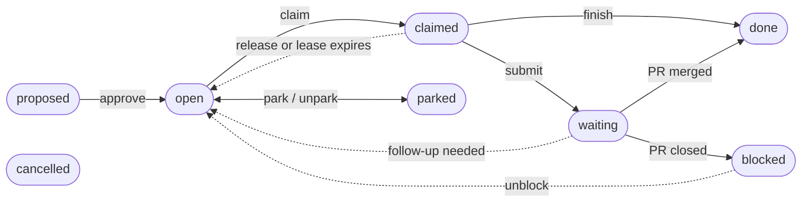

# Task Lifecycle and Policy

> **Status:** design, October 2026. Being built under `src/policy/` alongside the [task graph engine](task-graph-engine.md); none of it has shipped, and Shreni still runs on beads today.

This spec is Shreni's side of the task graph: the lifecycle it declares, who may do what, how plans get approved, which validators run, and how Sthapathi works the queue. Its code lives under `src/policy/`, one folder per area it governs, such as `src/policy/sthapathi/` for the worker's rules. The engine that enforces all of it is in [Task Graph Engine](task-graph-engine.md).

## The lifecycle

Shreni's lifecycle has eight states and thirteen moves, says where new tasks land, and says who may make the calls that aren't moves. The engine stores it as data and refuses anything it doesn't declare; the format, and what every lifecycle must meet, are in the engine spec's [Task lifecycle](task-graph-engine.md#task-lifecycle) section.

```ts
const nonTerminal = ['proposed', 'open', 'claimed', 'waiting', 'blocked', 'parked'];

const taskLifecycle = defineLifecycle({
  name: 'shreni.task',
  version: 1,                            // bump on every change
  states: {
    proposed:  {},
    open:      { claimable: true },
    claimed:   { leased: true },
    waiting:   {},                       // e.g. a PR is open
    blocked:   {},                       // needs a human
    parked:    {},                       // set aside on purpose
    done:      { satisfiesDeps: true, terminal: true },
    cancelled: { terminal: true },
  },
  create: { state: 'proposed', byRole: { system: 'open' } },   // only policy jobs skip approval
  moves: [   // by: the roles that may make the move; only the expiry hooks act as system
    { name: 'approve',  from: ['proposed'],                    to: 'open',      by: ['developer'] },
    { name: 'claim',    from: ['open'],                        to: 'claimed',   by: ['orchestrator', 'developer'] },
    { name: 'release',  from: ['claimed'],                     to: 'open',      by: ['orchestrator', 'developer'] },
    { name: 'expire',   from: ['claimed'],                     to: 'open',      by: ['system'] },
    { name: 'submit',   from: ['claimed'],                     to: 'waiting',   by: ['orchestrator'],              guard: hasOpenPr, clearsBoost: true },
    { name: 'finish',   from: ['claimed', 'waiting'],          to: 'done',      by: ['orchestrator', 'developer'], guard: checksPassed, clearsBoost: true },
    { name: 'followUp', from: ['waiting'],                     to: 'open',      by: ['orchestrator'],              boost: true },
    { name: 'flag',     from: ['open', 'claimed', 'waiting'],  to: 'blocked',   by: ['orchestrator', 'system'] },
    { name: 'unblock',  from: ['blocked'],                     to: 'open',      by: ['developer'] },
    { name: 'park',     from: ['proposed', 'open', 'blocked'], to: 'parked',    by: ['developer'] },
    { name: 'unpark',   from: ['parked'],                      to: 'open',      by: ['developer'] },
    { name: 'cancel',   from: nonTerminal,                     to: 'cancelled', by: ['developer'],                 clearsBoost: true },
    // containers are never claimed; Sthapathi, or the developer in a tracker project, completes one once its children settle
    { name: 'completeContainer', from: ['open'], to: 'done', by: ['orchestrator', 'developer'], guard: childrenSettled },
  ],
  permissions: {   // calls that aren't moves: role -> true (any state) or the states the task may be in
    'tasks.create':   { developer: true, planner: true, system: true, agent: true },   // where it lands is create's call
    'tasks.update':   { developer: ['proposed', 'open', 'blocked', 'parked'], planner: ['proposed'] },
    'tasks.delete':   { developer: ['proposed'], planner: ['proposed'] },
    'deps.add':       { developer: true, planner: ['proposed'] },   // the state of the task that waits
    'deps.remove':    { developer: true, planner: ['proposed'] },
    'links.add':      { developer: true, planner: true, orchestrator: true, agent: true },
    'notes.add':      { developer: true, orchestrator: true, agent: true },
    'plans.create':   { developer: true, planner: true },
    'plans.validate': { developer: true, planner: true },
    'lifecycles.activate': { developer: true },   // shreni task upgrade
  },
  hooks: {
    onApprove: 'approve', onClaim: 'claim', onDiscard: 'cancel', onLeaseExpiry: 'expire',
    onRepeatedExpiry: { after: 3, move: 'flag' },   // the third expiry in a row blocks the task
  },
});
```



Not drawn, to keep the picture readable: any state that is not `done` or `cancelled` can move to `cancelled`; `open`, `claimed` and `waiting` tasks can also be flagged to `blocked`; and containers skip the claim, since `completeContainer` takes them from `open` to `done`.

Solid arrows move work forward and dashed ones send it back; only `done` satisfies a dependency.

**Three guards.** Each follows the engine's guard contract: it reads only the database, returns `true` or a reason for refusing, and is named with `defineGuard`.

| Guard | On move | Allows the move when |
| --- | --- | --- |
| `hasOpenPr` | `submit` | The attempt's evidence records an open PR. Sthapathi writes the PR to `attempt_evidence` first, then fires `submit`, because a guard can't call GitHub |
| `checksPassed` | `finish` | The task's locked acceptance checks pass. A task with none, imported or filed by hand, is grandfathered: it finishes on review and gates when Sthapathi finishes it, or on the developer's word. Grandfathering is data, not a lifecycle version |
| `childrenSettled` | `completeContainer` | The task is a container, every child is in a terminal state, and at least one child is done |

## Boost and repeated expiry

`followUp` is the one move with `boost`: a PR follow-up goes ahead of all unboosted work, whatever its priority. That is today's rule (`selectFollowup` in `src/sthapathi/pr-followup.ts`): an open PR goes stale as main moves, and a reviewer is waiting. How the engine orders the queue and keeps or clears the flag is in the engine spec's [Claiming and leases](task-graph-engine.md#claiming-and-leases).

- **The boost survives a lost worker.** It is kept through `release`, `expire` and `flag`, and cleared by `submit`, `finish` or `cancel`, the moves marked clearsBoost. A follow-up whose worker dies still goes first, and so does one a developer unblocks, since its PR is still open.
- **Three expiries in a row block the task.** Shreni sets `onRepeatedExpiry: { after: 3, move: 'flag' }`, so a boosted task that keeps killing its worker can't starve the queue. The task goes to `blocked`, and only a developer can unblock it.
- **The count covers one round of work.** Any attempt that ends another way restarts it, including the flag itself. A `submit` restarts it too, so when a PR update draws new review comments, expiries from the earlier round don't count toward the next.
- **A sleeping laptop counts.** A lease that lapses while the machine sleeps is an expiry like any other; see the lease defaults under Open questions.

## Containers

An epic is a task of kind `container`: never claimed, and moved only by Shreni or the developer. When every child reaches a terminal state, the engine emits `children.settled` (engine spec, [Task lifecycle](task-graph-engine.md#task-lifecycle)). In a Kshetra, Shreni's policy then runs the intent check and fires `completeContainer`, whose `childrenSettled` guard refuses a work task, a container with open children, or one with no finished child. This replaces the auto-close in `closeEpicIfComplete` (`src/sthapathi/epics.ts`). The intent check comes in a later phase and isn't specified here.

- **In a tracker project** no orchestrator runs, so the developer completes an epic: `shreni task finish <epic>` fires `completeContainer` for a container. When a `finish` settles an epic's last child, the CLI says so and prints that command; when every child was cancelled, it suggests cancelling the epic instead.
- **Sthapathi doesn't rely on the event.** On start and on each poll it also asks the engine for containers whose children have all settled (`tasks.settled()`), so an event that fired while it was stopped still closes the epic.
- **All children cancelled.** `childrenSettled` refuses, and Sthapathi flags the epic for the developer, who cancels it or files new work under it. Completing it would mark it done and release its dependents with nothing built.
- **The intent check fails.** Sthapathi flags the epic, and the intent goes back to planning with the failing checks attached.
- **Parking or blocking an epic holds its children.** The engine claims a task only while every container above it is in the claimable state, so `park` on an epic takes its whole subtree out of the queue and `unpark` puts it back.
- **Cancelling an epic with live children** is refused by the engine. `shreni task cancel <epic> --with-children` cancels every non-terminal child, waiting tasks before the ones they wait on, and then the epic, in one transaction.
- **Cancelling a task that others wait on** is refused too, naming the waiting tasks, because nothing would ever release them. `shreni task cancel <id> --drop-deps` removes those edges in the same transaction, so the waiting tasks go ahead without it.

## Roles and access

Shreni defines five roles. The engine checks each call's role against the lifecycle's `by` lists and permissions, and records it on every event; that mechanism is in the engine spec's [Roles and access](task-graph-engine.md#roles-and-access).

| Role | Who | May |
| --- | --- | --- |
| `developer` | A human, through the planning menu, the CLI or Phalaka | Approve plans and lone tasks; claim, release and finish tasks by hand; unblock, park, unpark and cancel; edit any task that isn't claimed or waiting; complete epics; upgrade the lifecycle |
| `planner` | Suthradhara | Create plans and tasks (always `proposed`), add dependencies, run validation, revise its own proposed plans |
| `orchestrator` | Sthapathi | Claim, heartbeat, release, submit, finish, flag, follow up, complete containers, add notes |
| `system` | Policy jobs such as the health gate | Create tasks with origin `system`; the engine's hooks fire `expire` and `flag` with this role |
| `agent` | Silpi, Viharapala, the test author, the adversary | Read their own task, add notes to their own attempt, and file new tasks, which always land as `proposed` |

**Enforcement comes in three layers.** The engine provides the first and the third; the second is Shreni's.

1. **Now: policy checks.** The role is checked on every call. This prevents mistakes and makes intent explicit, but code in the same process could bypass it, because the role is declared by the caller.
2. **With the sandbox: no credentials.** Agents hold no database credentials. Their notes and filed tasks come back in the hand-back, and Sthapathi writes them with role `agent`. The sandbox is planned, not yet built.
3. **Later: database roles.** One Postgres role per Shreni role, each allowed only the engine's functions. It needs the PL/pgSQL port; when to port is in the engine spec's [Build vs. reuse](task-graph-engine.md#build-vs-reuse).

**Ownership is Sthapathi's check.** The permissions in [The lifecycle](#the-lifecycle) are by role and by the task's state, not by owner. Agents never call the engine, so Sthapathi writes their notes and filed tasks with role `agent`, against the task and attempt it dispatched them for and no other. There is one planner, so its own plans are simply the proposed ones.

## Approval: humans only

**Decision (2026-10-03): only a human approves a plan or a lone task, and only through the CLI or Phalaka.** No agent, Suthradhara included, can make work runnable. In the lifecycle this is the `developer` role on the `approve` move; the engine runs the validators and opens every task of the plan in one transaction (engine spec, [Validation](task-graph-engine.md#validation)).

- **Filing a plan.** Before launching Suthradhara, Shreni's process creates the plan, and the session gets its id (`SHRENI_PLAN`) and the planner role in place of today's `BEADS_DIR`. Suthradhara files with `shreni plan` commands: `task add` (title, parent, kind, priority, description, acceptance checks), `dep add` and `validate`. Every task lands in that plan as `proposed`, and `validate` hands back the findings for Suthradhara to fix before the session ends. Its design note is still a file, and there is nothing to sync.
- **Approve in the same terminal, right after planning.** `shreni suthradhara` already runs a loop owned by Shreni (`src/cli/suthradhara.ts`): when the planning session ends, Shreni's own process shows a summary and a menu (extend, new, end). That menu gains Approve. It shows the plan, its checks and any warnings, and the developer picks **approve**, **revise** (relaunch Suthradhara on the same plan, where it may edit or delete its proposed tasks), **discard** (cancel every task in the plan), or **decide later**. Approval is the developer's keystroke, read by Shreni's process, never a tool call by the agent.
- **Later, from the CLI.** `shreni task approve <id>` takes a plan left for later, or a lone task filed outside planning, such as one from `shreni task create`: the same view, an interactive terminal required, and the id typed to confirm. A lone task runs the task-scope validators.
- **Phalaka.** An Approve button on the plan view, served on `127.0.0.1` and authenticated by Phalaka's existing local token (`src/phalaka/token.ts`).
- **After approval.** Only a developer edits a task past `proposed`; the planner and agents change proposed tasks only (the permissions in [The lifecycle](#the-lifecycle)). A change Suthradhara wants to approved work is a new plan, approved again.
- **Recorded.** `plans.approve`, `plans.discard` and `tasks.approve` take the surface (`cli` or `phalaka`), and the event stores it with who acted (engine spec, [API](task-graph-engine.md#api)).

**Where filed tasks land.** The engine puts a new task where the lifecycle's `create` rule says, never where its filer asks (engine spec, [Task lifecycle](task-graph-engine.md#task-lifecycle)):

| Filed by | Origin | Lands in |
| --- | --- | --- |
| Suthradhara, in a plan | `plan` | `proposed`, approved with its plan |
| A person or a session, with `shreni task create` | `manual` | `proposed`, approved on its own |
| A policy job, such as the health gate's repair task (`ensureHealthBead` in `src/sthapathi/health.ts`) | `system` | `open`: pre-approved, because a red `main` stops all work |
| An adversary finding outside the task's spec (one inside it goes back to Silpi instead, below), a gap from today's post-merge Parikshaka, and tasks an agent files in its hand-back | `agent` | `proposed`, under the epic of the task that turned it up, or standalone if there is none or it has closed |
| `shreni migrate` | `imported` | Its bead's state, counted as approved |

**Decision (2026-10-08): what the adversary finds never starts on its own.** Parikshaka grows into the pre-merge adversary. It runs beside review: after Viharapala approves and before the merge, in the same attempt, and its feedback reaches Silpi the way review feedback does. The loop repeats until it finds nothing in scope or the round limit is reached. A finding goes one of three ways:

- **The change fails an edge case its own spec covers.** Back to Silpi in the same attempt, with the adversary's failing test added to the locked set. There is no new task and no approval, since the task is already approved.
- **An edge case the spec never named.** A new task with origin `agent`, landing `proposed`: under the epic of the task that turned it up, or standalone if that task has none. It carries a `discovered-from` link to that task and the failing test as its acceptance check, kept out of `main`. The developer approves it like any lone task. Until it is approved or cancelled, its epic can't complete, so a finding can't be lost.
- **The spec itself is wrong.** Back to Suthradhara to revise the plan, which the developer approves again.

Each finding carries its hash as its `key`, so one found twice is filed once. Until the adversary is built, today's Parikshaka keeps running after the merge (`src/sthapathi/parikshaka-dispatch.ts`). With the code already on `main` there is no Silpi to send a gap back to, so its gaps become proposed tasks. By then the merge may have completed the epic, and the engine refuses a task under a closed container, so a gap whose epic has closed is filed standalone, still linked to the task it came from. Considered, not adopted (2026-10-08): letting findings with a failing test start on their own, within a budget per epic. It added a second approval path and a creation guard to the engine for little gain.

The engine only records the approver; enforcing "humans only" is Shreni policy, since only those two surfaces call `plans.approve`, `tasks.approve` and `plans.discard`. The interactive-terminal check stops an agent approving by accident, but it is not a security boundary. Today an agent on the host could read the Phalaka token in `~/.shreni`. The real boundary is the sandbox: agents inside it have no database credentials and no access to `~/.shreni`.

## Validators

Shreni registers four validators on top of the engine's built-in checks. The validator interface, and when validators run, are in the engine spec's [Validation](task-graph-engine.md#validation). "Arrives with" names the later feature each one ships with.

| Validator | Severity | Checks | Arrives with |
| --- | --- | --- | --- |
| `acceptanceChecks` | error | Every work task has at least one complete given/when/then check | Locked acceptance checks |
| `coverage` | error | Every intent check is served by a task, and every task serves the intent | Locked acceptance checks |
| `graphShape` | warning | Task count and depth against the sizing default, using `topologicalGenerations` for depth and width | Locked acceptance checks |
| `collisions` | warning | Tasks with no ordering between them that declare the same touch-points | Concurrent workers |

**Per-project config** goes under `plan.validators` in the project's config file, `kshetra.yaml` or `tracker.yaml`. The setting comes from the shared base schema (Project config, below), so both kinds of project read it the same way and start from the same defaults. The values below are examples:

```yaml
plan:
  validators:
    acceptanceChecks: error
    coverage: error
    graphShape: { level: warning, maxTasks: 8, maxDepth: 4 }
    collisions: off
```

## Shreni's tables

Shreni's own tables live in a `shreni` schema beside the engine's `taskgraph` schema, so Shreni's writes can join the engine's transactions (engine spec, [Data model](task-graph-engine.md#data-model)). The engine never reads them.

| Table | Holds |
| --- | --- |
| `projects` | Shreni's details for each project: `mode` (`kshetra`, worked by Sthapathi, or `tracker`, tracked only), and optional `repo_url` (filled from the origin remote) and `team`. They live here because the engine knows nothing about repos or workers |
| `intents` | The developer's statement and intent-level checks, one per plan |
| `acceptance_checks` | Structured given/when/then checks for a task or intent, their mode (auto or manual), and the locked test paths and hashes |
| `attempt_evidence` | Per-attempt diff reference, PR, gate results, reviewer verdict per review round, adversary findings. The gate results' `acceptance.passed` records whether the task's acceptance checks all passed on that attempt, auto checks by the test gate and manual ones on the developer's confirmation; `checksPassed` reads it from the current attempt |
| `memories` | Project insights, today's `bd remember` entries |

## The database

The engine needs Postgres 15 or newer and takes its connection from Shreni (engine spec, [Data model](task-graph-engine.md#data-model)). Finding, creating and upgrading the database is Shreni's job.

- **Where Postgres comes from.** Shreni doesn't bundle a server. On macOS that is Homebrew's `postgresql@17` or Postgres.app; on Linux, the distribution's package; on Windows, the EDB installer; anywhere, the official Docker image. Init's Database phase looks for a server and, if none answers, prints the install and start commands for the platform and stops: the same hard gate as a missing agent CLI.
- **Where the connection string lives.** `~/.shreni/config.yaml` names each database the machine uses, with `local` for the developer's own (example below).
- **Which database a repo uses.** `kshetra.yaml` and `tracker.yaml` hold `database: <name>` beside the project's uuid, defaulting to `local`. A fresh clone of a company repo then knows it wants `acme`, and init asks for that entry if the machine lacks it. `SHRENI_DATABASE_URL` overrides both, for CI.
- **Secrets stay out of the repo.** A password comes from the environment variable the entry names, or from a `config.yaml` that only its owner can read; init refuses one that others can read.
- **Creating it.** If the server answers but the database doesn't exist, init creates it, then applies the schema migrations.
- **When Postgres is down.** A command that needs it fails at once, naming the database and the platform's start command. A worker retries a lost connection for a minute, reusing its request ids, then pauses the Kshetra for a manual resume.
- **Tools.** `shreni db dump` and `restore` need `pg_dump` and `pg_restore` at least as new as the server; init checks for them.

```yaml
# ~/.shreni/config.yaml
user: dev@example.com        # the developer on attempts and events; defaults to git config user.email
databases:
  local: { url: postgres://localhost:5432/shreni }
  acme:  { url: postgres://db.acme.internal:5432/shreni, user: dev, passwordEnv: ACME_PG_PASSWORD }
```

**What init checks.** It detects and explains, and never installs a server: that means choosing a version and an install method, and a half-finished install is worse than clear instructions.

| Init finds | It does |
| --- | --- |
| No Postgres installed | Prints the platform's install and start commands, and exits non-zero |
| Installed, but not running | Prints the start command, and offers to run it (y/N) when it needs no `sudo`, as with Homebrew or Postgres.app |
| Running, but the login fails | Names the database user it tried, and the `createuser` command or config entry that fixes it |
| Running, but older than 15 | Stops, and says so |
| Running, but the database is missing | Creates it, or prints the command when it lacks permission |
| `pg_dump` missing, or older than the server | Warns. It blocks only the commands that take a dump first: an import, shreni task upgrade and shreni db migrate |

Without a terminal the checks are the same, with no prompts: init exits non-zero with the message. `shreni db check` runs them at any time.

**Schema migrations in practice.** The engine's rules are in its [Schema migrations](task-graph-engine.md#schema-migrations): migrations run only when asked, and only processes older than a migration's minimum are fenced out. Shreni's own schema follows the same rules, with its bookkeeping in `shreni.kysely_migration`.

- `shreni db migrate` applies pending migrations to both schemas, `taskgraph` first, after taking a dump.
- `shreni start` and `shreni init`, run in a terminal, show what is pending and offer to run it. Started detached, they refuse and print the command.
- On a shared database one person runs it. Everyone else keeps working unless a migration raised the minimum, and then their writes say which release to upgrade to.

## Backups

The database starts as self-run Postgres (engine spec, [Data model](task-graph-engine.md#data-model)), so Shreni backs it up itself, with periodic dumps to local disk for recovery.

- **What.** `shreni db dump` writes a `pg_dump` of the whole database, both schemas, to `~/.shreni/backups/`, named by time.
- **Whose.** Only a database on this machine. A shared company database is backed up by whoever runs it; `shreni db dump` against one says so and stops, unless given `--remote`.
- **When.** At most once a day, started in the background by the first `shreni` command after the newest dump turns 24 hours old; and always before an import, by `shreni init` or `shreni migrate`, and before `shreni task upgrade` and `shreni db migrate`, which wait for it. Every change goes through a `shreni` command, so a day with no commands needs no dump.
- **Kept.** The last 14 daily dumps, and every dump taken before an import, an upgrade or a migration.
- **Recovery.** `shreni db restore <file>`, with every worker stopped, replaces the database with the dump. Work done since that dump is lost; the restored events show where it ends.
- **Limit.** Dumps on the same disk recover from a bad migration, a bad upgrade or a broken database, not from losing the machine. Copying `~/.shreni/backups/` elsewhere covers that, and a hosted database later makes it the host's job.

## Running work

Sthapathi is the only orchestrator. This is how it uses the engine's claims, leases and notifications (engine spec, [Claiming and leases](task-graph-engine.md#claiming-and-leases) and [Events and history](task-graph-engine.md#events-and-history)).

**Worker and agent.** The two words mean different things here:

|  | Worker | Agent |
| --- | --- | --- |
| What it is | A Sthapathi process, started by `shreni start`, running one Kshetra's queue (`src/sthapathi/`) | A provider CLI session (`claude`, `codex` or `gemini`) the worker launches: Silpi codes, Viharapala reviews, Parikshaka looks for gaps (`src/agents/`) |
| Lifetime | Hours or days, across many tasks | One round of one task |
| Talks to the engine | Yes, with role `orchestrator`: claims, heartbeats, moves, notes | Never; the worker writes its notes and filed tasks with role `agent` |
| How many | One per Kshetra | Several per task, one after another |

Work done by hand has no worker. Each `shreni task` command acts with role `developer`, and a Claude Code session working that way acts for the developer, not as an agent ([Tracker-only projects](#tracker-only-projects)).

- **One attempt per try.** An attempt is one claim by one Sthapathi worker: the whole Silpi ↔ Viharapala loop for one try at the task, with the pre-merge adversary once it lands, with its rounds, verdicts and findings in `shreni.attempt_evidence`. Agents never touch the engine. A task has several attempts when a PR follow-up is claimed again, or when a lease expires and another worker takes over. The `worker` value is the host and process id, for example `my-laptop/48211`.
- **The worker heartbeats, not the agent.** An agent round can run for tens of minutes. Shreni's suggested defaults are a 10-minute lease renewed every 2 minutes, so a dead worker's task returns to `open` within one lease length plus one poll.
- **Merging is outside the database,** so fencing alone can't protect it. Sthapathi heartbeats immediately before merging, which both verifies and extends the lease, then merges, then fires `finish`. The remaining exposure is a lease expiring during the merge itself, which a 10-minute lease makes negligible.
- **Woken by notifications.** Sthapathi claims as soon as something becomes ready, instead of polling every 30 s. That removes the wait of up to 30 s before each task. A slow fallback poll (60 s, say) covers missed notifications.
- **Swept on every poll.** Sthapathi calls `expireLeases` on its fallback poll as well as before each claim, so a dead worker's task is back within one lease length plus one poll.
- **Epics are reconciled, not only notified.** On start and on each poll, Sthapathi completes or flags the containers `tasks.settled()` returns ([Containers](#containers)).
- **One worker per Kshetra, across machines.** `worker.pid` (`src/cli/pid.ts`) sees one machine only, and with a company database two machines could each start a worker for the same Kshetra. So a worker also takes a session lock in the database, `tg.locks.trySession('worker')`, on the engine's listener connection, and refuses to start without it, naming the holder's host. Postgres drops the lock when the connection dies, so a crashed worker never leaves it behind. Running several workers on one Kshetra is an open question.
- **Phalaka updates live,** replacing the polling and caching in `phalaka/beads-read.ts`.

## Tracker-only projects

A project can be tracked without ever being worked: Shreni keeps its task graph, but no worker runs on it. Shreni's own repo is the first.

- **Where it's set.** `shreni.projects.mode` is `tracker` instead of `kshetra`. `shreni init` sets it by asking, and only init changes it ([Init](#init)).
- **How it's found.** The repo holds `.shreni/tracker.yaml` with the project's uuid and its other settings (Project config), so `shreni task` knows which project the current directory belongs to. There is no `kshetra.yaml` and no entry in `~/.shreni/registry.json`.
- **How it's enforced.** `shreni start` refuses a tracker project, `shreni init` makes it a Kshetra only when asked explicitly, and the policy layer refuses every orchestrator call on it. Its tasks are only ever worked by hand.

**Working by hand.** In a tracker project, a person, or a Claude Code session acting for them, works a task by hand with the developer role. In a Kshetra only the developer does, and only while its worker is paused: there `shreni task claim` refuses unless the worker is paused and the terminal is interactive, so a session never works a Kshetra's tasks, as the Kshetra block also says.

- `shreni task claim <id>` takes one specific ready task, through the engine's claim with a filter on the id ([Claiming and leases](task-graph-engine.md#claiming-and-leases)). The lease lasts 8 hours by default. The attempt records the developer (`user` in `~/.shreni/config.yaml`, defaulting to `git config user.email`) and a worker of `cli:<user>@<host>`.
- **Later calls find the claim by its holder.** `note`, `finish` and `release` run in new processes, so they get the task's live attempt back with the engine's `claims.resume`, which returns it only to the developer who holds it; every write is then fenced as a worker's is. Each of those calls renews the lease. Anyone else gets `LeaseHeld`, naming the holder. `shreni task release <id> --force` takes it back, and the event records who did.
- **Every run sweeps first.** Each `shreni task` call runs `expireLeases` for its project before anything else, so a claim that lapsed overnight is back in `ready` by morning and counts toward the three-expiry limit.
- `shreni task finish <id> --reason "…"` fires `finish`, and `checksPassed` applies as for any task; on an epic it fires `completeContainer` ([Containers](#containers)). `shreni task release <id>` gives the task back.
- `approve` and `upgrade` need an interactive terminal, which a Claude Code shell isn't, so a session can't approve by accident. That is an accident guard, not a security boundary.

## Init

`shreni init` sets up either kind of project, and its first question decides which: **will Shreni work tasks in this repo, or only track them?** The question has no default. A non-interactive run must pass `--mode kshetra` or `--mode tracker`, or init refuses. The command replaces today's `shreni init-kshetra`.

| Phase | Kshetra | Tracker |
| --- | --- | --- |
| App repo: create it on GitHub if missing | yes | no: a tracked repo already exists |
| Base branch | yes | no: no worker merges |
| Database: reach the server, create the database if missing, apply migrations (The database) | yes | yes |
| Project: register it in the database, with its uuid, `id_prefix` and mode | yes | yes |
| Import: if `.beads` exists, a dry run, confirmation, then the import | yes | yes |
| Instructions: Shreni's block in each provider's instruction file, and the `prime` hooks | the Kshetra block | the tracker block |
| Config | `kshetra.yaml`, conventions, the RAG stub | `tracker.yaml` only (Project config) |
| Register in `~/.shreni/registry.json` | yes | no: never registered, so no worker can start |

The follow-up questions differ too. A Kshetra keeps today's provider, model and preflight questions. A tracker asks only which agent CLIs people use in the repo, to pick the instruction files; it defaults to Claude and skips the preflight. As today, every phase is idempotent, so a re-run after a failure resumes.

**Instructions.** The Instructions phase writes Shreni's block into each provider's instruction file, in the version that matches the mode. The design and both templates are in [Instructions for agent sessions](#instructions-for-agent-sessions).

**Changing mode** is deliberate:

- **Tracker to Kshetra:** `shreni init --mode kshetra` on a tracker repo, confirmed by typing the project's name. It is the only way a tracker repo is ever worked.
- **Kshetra to tracker:** allowed once no worker is running; it removes the repo from the registry.
- **Init again in the same mode** refreshes the project and resumes any phase left unfinished.

## Project config

**Decision (2026-10-09): one config file per kind of project, both built on one shared schema.** A Kshetra's settings live only in `.shreni/kshetra.yaml`, and a tracker's only in `.shreni/tracker.yaml`. Both files are checked by zod schemas that extend one base, so a setting both kinds use has one definition, one default and one meaning, and can't drift between them.

| Schema | Holds | File |
| --- | --- | --- |
| `ProjectConfigBase` | `name` and `description`; `project`, the uuid; `database`, the entry in `~/.shreni/config.yaml` (The database); `plan.validators` (Validators) | Neither on its own |
| `KshetraConfig` | The base, plus everything a worker needs: `id`, `repo`, `stack`, `pack`, `conventions`, `agents`, `priority`, `gates`, `watchdog`, `budget`, `mcp`, `ablation` | `kshetra.yaml` |
| `TrackerConfig` | The base, plus `providers`: the agent CLIs people use in the repo, which pick its instruction files | `tracker.yaml` |

- **Where it starts.** Today's `KshetraConfigSchema` (`src/kshetra/config.ts`) becomes `ProjectConfigBase.extend(…)`, minus `beads`, which the migration drops. `loadKshetraConfig` keeps its job, and a `loadTrackerConfig` beside it reads `tracker.yaml`.
- **Shared code takes the base.** Anything that serves both kinds, such as `shreni task`, the validators or the database lookup, reads `ProjectConfigBase`, never a field of one kind.
- **Defaults live in the base.** A tracker and a Kshetra start from the same validator settings, and either file can override them for its project.
- **A setting moves into the base** when a second kind needs it, never by copying it into the other schema.
- **Hand-filed tasks can carry checks.** `shreni task create --check "given … when … then …"`, repeatable, adds acceptance checks, so a lone task can pass the `acceptanceChecks` validator when it is approved.

## Instructions for agent sessions

Agent sessions learn the rules from their instruction file, so Shreni writes the rules there and keeps them current. Each repo gets one block in each provider's file, in one of two versions chosen by the project's mode.

- **Which files.** `providerInstructionFile` (`src/agents/providers/registry.ts`) resolves each provider to its file: `CLAUDE.md` for Claude, `AGENTS.md` for Codex, `GEMINI.md` for Gemini. A Kshetra gets its configured provider's file; a tracker gets one for each provider in `tracker.yaml`, Claude by default.
- **Markers.** The block sits between `<!-- shreni:begin <mode> v<N> -->` and `<!-- shreni:end -->`. Shreni rewrites only what is between them and never touches the rest of the file. The mode in the marker lets init catch a block of the wrong kind; the version lets `prime` catch an old one.
- **One source.** Both versions are templates shipped with Shreni, and `shreni task prime` prints the same text with the project's memories, so the file and the CLI can't drift apart.
- **Kept current.** Init writes the block, and `shreni task setup` rewrites it on demand, for example after an upgrade changes a template. `prime` warns when the block's version is behind, but never edits a committed file on its own.
- **Hooks.** For Claude Code, setup also installs the session-start and pre-compaction hooks that run `shreni task prime`, in place of the `bd prime` hooks that `bd setup claude` installs today. Codex and Gemini get the block only.
- **Replaces** `appendShreniIntegration` (`src/cli/init-kshetra.ts`), which appends `SHRENI INTEGRATION` to `CLAUDE.md` once and never updates it.

**The two versions never mix.** In a Kshetra, Silpi runs natively and reads the same file as a person's session. A Kshetra file must never carry the by-hand workflow, or an agent could start claiming tasks.

**Tracker block**, for tracker-only repos such as Shreni's own. It is the by-hand workflow ([Working by hand](#tracker-only-projects)):

```markdown
<!-- shreni:begin tracker v1 -->
## Task tracking

This repo is tracked with `shreni task`. It is tracker-only: Shreni never runs work here.
Use the installed `shreni`, never a build from this checkout.

1. `shreni task ready` lists open tasks with nothing blocking them.
2. `shreni task claim <id>` takes one. It is yours for 8 hours, and any
   `shreni task note` on it renews the claim.
3. Do the work. `shreni task note <id> "…"` records progress.
4. `shreni task finish <id> --reason "…"` once it is reviewed and pushed,
   or `shreni task release <id>` to give it back. An epic finishes
   the same way once all its tasks are done.
5. If you stop without finishing, the claim lapses after 8 hours. Three lapses
   in a row block the task for the developer.

Filing and remembering:

    shreni task create --title "…"   # lands as proposed; the developer approves it
    shreni task remember "…"         # an insight for later sessions

Never run `shreni task approve` or `shreni task upgrade`; those are the developer's.
<!-- shreni:end -->
```

**Kshetra block**, today's `SHRENI INTEGRATION` rule with `bd` swapped for `shreni task`:

```markdown
<!-- shreni:begin kshetra v1 -->
## Shreni

This project is a Kshetra: Shreni's worker picks up its tasks and implements them
with its agents.

If your instructions give you a Shreni agent role for a task (Silpi, Viharapala or
another), this section does not apply to you: do the job you were given. The rules
below are for interactive sessions, which file work and do not do it.

    shreni task create --title "…"   # lands as proposed; the developer approves it
    shreni task ready / show / list  # read the queue
    shreni task remember "…"         # an insight for later sessions

Never, in an interactive session:
- `shreni task claim` or `shreni task finish`: the worker claims and finishes tasks.
- `git checkout -b`: the worker owns every task branch.
- `shreni task approve` or `shreni task upgrade`: those are the developer's.

Useful: `shreni status --all`, `shreni agents`, `shreni logs --kshetra <id>`,
`shreni pause --kshetra <id>`, `shreni resume --kshetra <id>`.

### Toolchain config sync

Shreni runs build, test and lint from the pointers in `.shreni/kshetra.yaml`.
When you add or change a toolchain config, update the matching pointer in the
same change: `stack.buildCommand`, `stack.testRunner`, `stack.lintCommand`.
<!-- shreni:end -->
```

## Lifecycle upgrades in practice

The engine's rules for versions, fencing and upgrades are in the engine spec's [Versions and upgrades](task-graph-engine.md#versions-and-upgrades). Shreni's side is who runs an upgrade, and how:

- **A snapshot test guards the version.** The stored hash covers guard names, not their code, so a snapshot test in Shreni also covers each guard's source. Making a guard stricter without a version bump fails in review.
- **The author writes the mapping.** Whoever changes the lifecycle says where tasks in a removed or renamed state go, for example `migrate: { parked: 'open' }`.
- **`shreni task upgrade` applies a new version.** Like approval, it needs an interactive terminal. It shows the states and moves added or removed, roles changed, guards changed by name, the tasks the mapping moves, and any live leases, then asks to confirm. A new project starts on the version `shreni init` registers.
- **`shreni start` asks.** Run in a terminal, a worker with a newer lifecycle shows the same summary and asks to upgrade. Started detached, it refuses and prints the command.
- **Why not automatic.** A build run from a worktree would change the rules under live workers, and an upgrade can move real tasks. Whether a change is safe can't be checked mechanically, because a guard can get stricter while no state changes. Lifecycle changes are rare, so the cost is one prompt at start.
- **One lifecycle for every Kshetra.** Each Kshetra upgrades on its own. A per-Kshetra lifecycle, such as an extra review state, could come later through `kshetra.yaml`.

## Open questions

- [ ] **Lease defaults** (10 minutes, renewed every 2, for workers; 8 hours for work by hand): check them against real round durations in the run logs. A laptop that sleeps through a lease also counts toward the three-expiry limit.
- [ ] **What `shreni task` needs on day one:** ready, show, list, create (as `proposed`), claim, note, finish (an epic too), release (with `--force`), cancel (with `--with-children` and `--drop-deps`), remember, setup, approve (a plan or a lone task), upgrade, and a `prime` that replaces `bd prime` for Claude Code sessions. For Suthradhara: `shreni plan task add`, `dep add` and `validate`. For the database: `shreni db check`, `migrate`, `dump` and `restore`.
- [ ] **The decision ledger:** it moves to `~/.shreni/kshetra/<id>/ledger.jsonl` with the migration. Does it move into the engine's events later?
